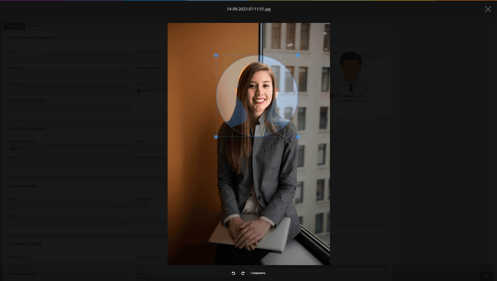

# b-face-cropper

## Face cropper modal can be called in any form as below:

```javascript
page.faceCropper($file, onCrop, rounded, faceShaped);
```

## Parameter descriptions:

| parameter    | is required | default |      type      | description                                                     |
| ------------ | :---------: | :-----: | :------------: | --------------------------------------------------------------- |
| `$file`      |   required  |    -    | File(), Object | input image file, or object of photo with keys: SHA, name, type |
| `onCrop`     |   required  |    -    |    Function    | Callback function which gets cropped image file as a parameter  |
| `rounded`    |   optional  |  false  |     Boolean    | true - rounded cropbox, false - square cropbox                  |
| `faceShaped` |   optional  |  false  |     Boolean    | true - face shaped cropbox, false - simple cropbox              |

## Example with face shape:

```javascript
function openCropper($file) {
  page.faceCropper($file, croppedPhoto => {
    d.photo = croppedPhoto;
  }, true, true);
}
```

<figure><figcaption></figcaption></figure>

## Example without face shape:

```javascript
function openCropper($file) {
  page.faceCropper($file, croppedPhoto => {
    d.photo = croppedPhoto;
  }, true);
}
```

<figure><figcaption></figcaption></figure>

## Hotketys:

| hotkey    | action                                        |
| --------- | --------------------------------------------- |
| `escape`  | closes the cropper modal                      |
| `enter`   | crops & saves the photo, and closes the modal |
| `↑`       | moves crop-box up                             |
| `↓`       | moves crop-box down                           |
| `←`       | moves crop-box left                           |
| `→`       | moves crop-box right                          |
| `alt + ↑` | moves crop-box up faster                      |
| `alt + ↓` | moves crop-box down faster                    |
| `alt + ←` | moves crop-box left faster                    |
| `alt + →` | moves crop-box right faster                   |
| `[`       | zooms out crop-box                            |
| `]`       | zooms in crop-box                             |
| `alt + [` | zooms out crop-box faster                     |
| `alt + ]` | zooms in crop-box faster                      |
