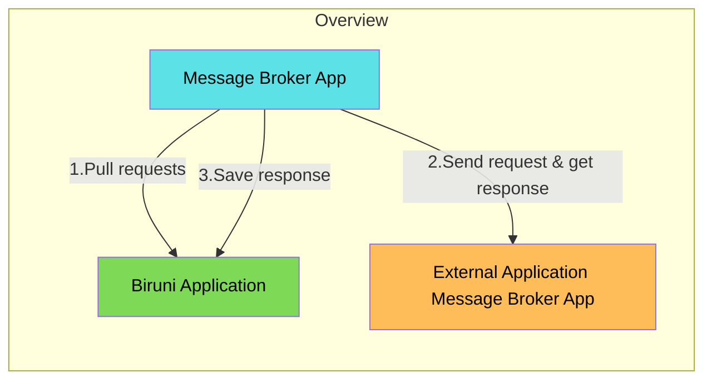
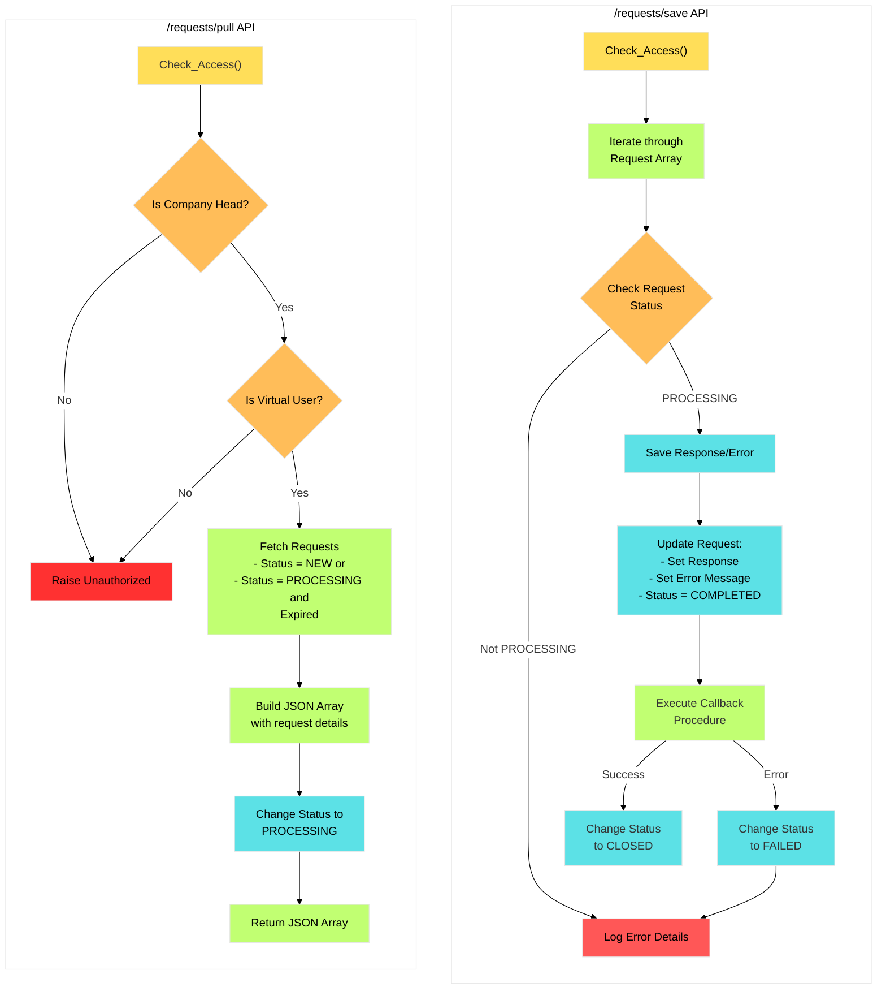

# BMB

### Prerequisites

#### Virtual User Setup

1. Execute the `bmb_user.sql` script located in `bmb/setup` directory to create the virtual user
2.  Configure Message Broker Application properties with created user credentials:

    ```properties
    bmb.username=<created_virtual_user>
    bmb.password=<virtual_user_password>
    ```

### Overview

The BMB module helps developers send requests to other applications or message brokers. It provides functionality to configure endpoints, create requests, and process responses through callback procedures.



Request flow in BMB module:



### Usage Guide

#### 1. Creating an Endpoint

To register your endpoint using `BMB_API.ENDPOINT_SAVE`, use the following PL/SQL block:

```sql
BEGIN
  Bmb_Api.Endpoint_Save(
    i_Base_Url           => 'https://smartupacademy.uz',
    i_Uri                => '/student/list',
    i_Method             => 'GET',
    i_Destination        => 'A',  -- 'A' for Application, 'B' for Broker
    i_Callback_Procedure => 'STUDENT_PKG.HANDLE_LIST',
    i_Company_Id         => :company_id,
    i_Code               => 'STUDENT_LIST',
    i_Name               => 'Get Student List'
  );
END;
```

**🔐 OAuth2 Support**

If the endpoint supports OAuth2, include the `i_Oauth2_Provider` parameter.\
Note that the OAuth2 provider must be pre-configured in the Biruni Message Broker Application. Learn more

```sql
BEGIN
  Bmb_Api.Endpoint_Save(
    i_Base_Url           => 'https://smartupacademy.uz',
    i_Uri                => '/student/list',
    i_Method             => 'GET',
    i_Destination        => 'A',  -- 'A' for Application, 'B' for Broker
    i_Oauth2_Provider    => '<provider-name>',  -- OAuth2 provider name
    i_Callback_Procedure => 'STUDENT_PKG.HANDLE_LIST',
    i_Company_Id         => :company_id,
    i_Filial_Id          => :filial_id,
    i_Code               => 'STUDENT_LIST',
    i_Name               => 'Get Student List'
  );
END;
```

`i_Oauth2_Provider` -> You can get available provider names via sending a\
GET request to:

```
http://your-biruni-message-broker-uri/artemis/api/v1/oauth2-provider
```

#### 2. Creating Requests

Choose the appropriate REQUEST\_SAVE overload based on your needs:

```sql
-- Simple request
BEGIN
  Uit_Bmb.Request_Save(
    i_Endpoint_Code => 'STUDENT_LIST',
    i_Send_After    => Current_Timestamp + 1, -- Request will be sent after this time
    i_Source_Table  => 'STUDENTS',
    i_Source_Id     => '12345'
  );
END;

-- Request with parameters
BEGIN
  Uit_Bmb.Request_Save(
    i_Endpoint_Code => 'STUDENT_LIST',
    i_Params        => '/tatu?grade=A&year=2025',
    i_Source_Table  => 'STUDENTS',
    i_Source_Id     => '12345'
  );
END;

-- Request with headers and body
DECLARE
  v_Headers Json_Object_t := Json_Object_t();
  v_Body    Json_Object_t := Json_Object_t();
BEGIN
  v_Headers.Put('Authorization', 'Bearer token123');
  v_Body.Put('studentId', '12345');

  Uit_Bmb.Request_Save(
    i_Endpoint_Code => 'STUDENT_LIST',
    i_Headers       => v_Headers,
    i_Body          => v_Body,
    i_Source_Table  => 'STUDENTS',
    i_Source_Id     => '12345'
  );
END;
```

**Synchronized requests**

Synchronized requests allow you to define a dependency between multiple requests so that they are processed sequentially.

* When the system processes requests, the second request will be processed only after the first request is finished.
*   If the first request is not finished, the second request will remain pending.

    ```sql
    declare
      v_Request_Id number;
    begin
      v_Request_Id := Uit_Bmb.Request_Save(i_Endpoint_Code => 'STUDENT_LIST',
                                           i_Source_Table  => 'STUDENTS',
                                           i_Source_Id     => '12345');

      Uit_Bmb.Request_Save(i_Endpoint_Code => 'STUDENT_LIST',
                           i_Source_Table  => 'STUDENTS',
                           i_Source_Id     => '12345',
                           i_Sync_Id       => v_Request_Id);
    end;
    ```

#### 3. Handling Responses

Create a callback procedure to process the response. The procedure will be automatically executed when the response is received:

```sql
CREATE OR REPLACE PROCEDURE Handle_List IS
  v_Response      CLOB;
  v_Error_Message VARCHAR2(4000);
  v_Source_Table  VARCHAR2(30);
  v_Source_Id     NUMBER;
BEGIN
  -- Get response data using BMB_GLOBAL package
  v_Response      := Bmb_Global.Response;
  v_Error_Message := Bmb_Global.Error_Message;
  v_Source_Table  := Bmb_Global.Source_Table;
  v_Source_Id     := Bmb_Global.Source_Id;

  -- Process the response
  IF v_Error_Message IS NULL THEN
    -- Handle successful response
    -- Update your source table/record
  ELSE
    -- Handle error
    -- Log or handle error appropriately
END IF;
END;
```

#### Available BMB\_GLOBAL Functions

Use these functions in your callback procedure to access request data:

* `Company_Id`: Returns the company ID
* `Request_Id`: Returns the request ID
* `Filial_Id`: Returns the filial ID
* `Response`: Returns the response payload
* `Error_Message`: Returns error message if any
* `Project_Code`: Returns the project code
* `Source_Table`: Returns the source table name
* `Source_Id`: Returns the source record ID

#### Manual Callback Re-execution

If a request is in COMPLETED or FAILED status, you can manually re-execute its callback procedure:

```sql
BEGIN
  Bmb_Api.Request_Callback_Procedure_Execute(
    i_Company_Id => :company_id,
    i_Request_Id => :request_id
  );
END;
```

This is useful when you need to:

* Retry failed callback executions
* Re-process responses for stuck requests
* Test callback procedure modifications

#### Data Cleanup

The system automatically cleans up old requests to maintain database performance:

* CLOSED requests older than `Bmb_Pref.c_Closed_Request_Retention_Days` are deleted
* Related request logs are cleaned up when their associated requests are removed
* Running via procedure `Bmb_Core.Clear_Old_Closed_Requests`

Note: Make sure to extract any needed information from responses before the retention period expires.

### Request Processing Notes

* NEW requests are picked up automatically by the broker
* PROCESSING requests that haven't been updated for longer than the expiration time will be reprocessed
* Callbacks are executed automatically after response is received
* Request status changes to CLOSED on successful processing or FAILED on errors

### Best Practices

1. **Error Handling**
   * Include error handling in callback procedures
   * Use request logs for debugging purposes
2. **Source Tracking**
   * Always provide `i_Source_Table` and `i_Source_Id` for request tracking
   * Use these in callback to update original records
3. **Request Parameters**
   * Use appropriate Request\_Save overload based on your needs
   * Consider using JSON objects for complex headers/body
4. **Callback Procedures**
   * Keep callback procedures focused and specific
   * Handle both success and error cases
   * Update source records with response status

### Monitoring

* Monitor the BMB\_REQUESTS table for request statuses
* Check BMB\_REQUEST\_LOGS for error details
* Use request\_id and source\_id for tracking specific requests
