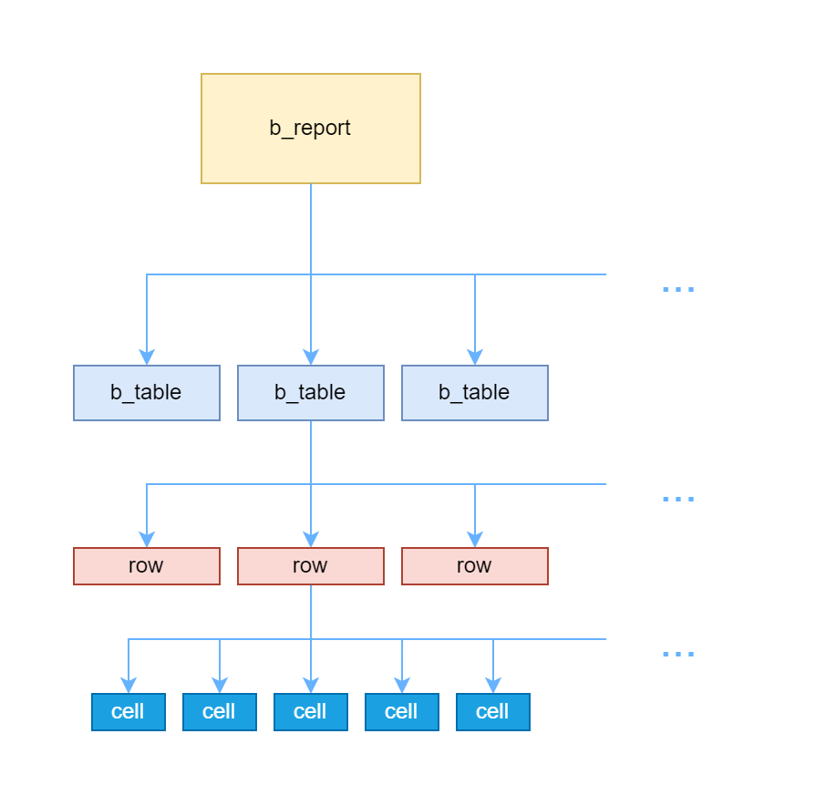

# Biruni report

Biruni Report is a hierarchical reporting system where **b\_report** acts as the root, containing multiple **b\_table** instances that organize data into rows and cells. Data is inserted sequentially, with rows created first, followed by cell entries, supporting various formats like text, tables, and images. The system allows customization through column widths, page breaks, and extensive styling options, including custom and built-in styles for borders, fonts, and alignment. With its structured approach, Biruni ensures clear data representation, flexible formatting, and professional report generation.

### Creating report

Reports are generated using the `b_report` package. There are two ways to open a workbook:

#### Standard Workbook:

```plsql
b_Report.Open_Book(report_type, file_name);
```

#### Workbook with Styles:

```plsql
b_Report.Open_Book_With_Styles(report_type, file_name);
```

Once the workbook is opened with styles, it functions as a standard workbook but includes additional [built-in styles](biruni-report.md#built-in-styles).

#### Parameters

* `report_type` – Specifies the [type of report](biruni-report.md#report-types) to generate.
* `file_name` – The name of the output file.

Both functions have their overloaded versions where the first parameter can be a `HashMap`. In this case, the map must contain a key `rt`, with its value specifying the report type.

After opening report it should be closed at the end using `b_Report.Close_Book`


There cannot be opened more than one workbook at a time


### Report types

<table><thead><tr><th width="160">Output</th><th width="122" align="center">Report type</th><th width="320">Description</th><th align="center">Extension</th></tr></thead><tbody><tr><td>Excel</td><td align="center">xlsx</td><td>Report data is displayed across table rows and columns.</td><td align="center">.xlsx</td></tr><tr><td>Html</td><td align="center">html</td><td>An HTML document where data is displayed using the <code>&#x3C;table></code> tag, with multiple sheets organized into navigation tabs (<code>&#x3C;ul></code> with <code>&#x3C;li></code>). Each tab functions as a separate sheet.</td><td align="center">.html</td></tr><tr><td>Html Mobile</td><td align="center">htmlm</td><td>Responsive html code for mobile devices</td><td align="center">.html</td></tr><tr><td>Html Style</td><td align="center">htmls</td><td></td><td align="center">.html</td></tr><tr><td>Html Debug</td><td align="center">htmld</td><td>Html used for Debug</td><td align="center">.html</td></tr><tr><td>Html JOD</td><td align="center">htmljod</td><td>Converted from excel report using JODConverter</td><td align="center">.html</td></tr><tr><td>PDF</td><td align="center">pdf</td><td>Converted from excel report using JODConverter</td><td align="center">.pdf</td></tr><tr><td>CSV</td><td align="center">csv</td><td>Comma Separated Value(s)</td><td align="center">.csv</td></tr><tr><td>XML</td><td align="center">xml</td><td></td><td align="center">.xml</td></tr></tbody></table>

### Report hierarchy

Biruni's report structure is organized into a hierarchical format, ensuring clear data representation and styling control:

* **b\_report** — The root container that holds one or more `b_table`.
* **b\_table** — Represents a table within the report, similar to sheets in Excel, and contains multiple rows.
* **Row** — A collection of cells
* **Cell** — The smallest unit where data is written and styles are applied.

<figure><figcaption></figcaption></figure>

## Tables

The Biruni reports core component is the table. A table can be considered a spreadsheet that organizes data into rows and columns while also providing various customization options for formatting, layout, and printing.

### Creating table

Tables are created using the `b_table` object type. Since it is an object type, we instantiate it through `b_report` to define the table:

```plsql
test_table b_Table := b_Report.New_Table();
-- or
test_table b_Table := b_Report.New_Table(i_Parent => /* parent_table */);
```


When a table is created using a parent parameter, the child table inherits the current style of its parent.


### Inserting data into table

In `b_table`, data insertion follows a structured sequence. You need to create the row to access the next row and write into its cells.

> For the following code blocks we will use `a b_Table = b_Report.New_Table();` instance.

#### Creating new row

```plsql
a.New_Row();
-- or
a.New_Row(i_Height => /* number */);
```

When a new row is created, the cursor moves to the first cell of the next row.

#### Writing data

```plsql
a.Data('test-data');
```

This procedure performs two actions:

* Inserts data into the current cursor cell.
* Moves the cursor one cell to the right.

There are several ways to insert data into a cell, which will be covered [here](biruni-report.md#data).


When a table is newly created, data cannot be inserted immediately. Ensure that at least one row is created first before adding any data.


#### Visual example

The image illustrates how the cursor moves. When a new row is created using `New_Row()`, the cursor moves to the beginning of that row. Each `Data()` command inserts a value into the current cell and then shifts the cursor one cell to the right.

<figure><figcaption></figcaption></figure>

### Page settings

Outside of the table data, additional settings allow us to adjust the table structure and page layout, such as column width and page breaks.

#### Column width

```plsql
a.Column_Width(i_Column_Index => /* number */,
                      i_Width => /* number */);
```


It is recommended to set the column width before inserting data into the table to maintain better code control over time and keep all structural configurations in one place for easier management.


#### Page breaks

Page breaks in Biruni Report are used to separate the table across standard paper sizes (e.g., A4, A5, Letter).

```plsql
a.Page_Break(/* parameters */);
```

Each parameter is nullable and take `boolean`. To enable it, set the value to `true`.

<table><thead><tr><th width="260">Parameter</th><th>Description</th></tr></thead><tbody><tr><td><p>i_Row_Break</p><p>i_Column_Break</p></td><td>Puts row/column break</td></tr><tr><td><p>i_Row_Breakable</p><p>i_Column_Breakable</p></td><td>If the data between the previous row breakable and the current row breakable does not fit to the page size, a row/column break is inserted; otherwise, row/column breaks are skipped.</td></tr></tbody></table>

### Add sheet to the report

After completing the table, you need to add it to the report using the `Add_Sheet` method of `biruni_report`. Here’s how:

```plsql
biruni_Report.Add_Sheet(i_Name  => /* name */,
                        p_Table => /* table */,
                        /* other parameters */);
```

The `i_Name` and `p_Table` parameters are required, while all other parameters are nullable.

#### Parameters

<table><thead><tr><th>Parameter</th><th width="257">Description</th><th>Sample input</th></tr></thead><tbody><tr><td>i_Name</td><td>Accepts <code>varchar2</code>, table name</td><td><code>test_name</code></td></tr><tr><td>i_Table</td><td>It accepts a <code>b_Table</code> object, and once added to the sheet, it will be closed and no longer usable.</td><td></td></tr><tr><td>i_Param</td><td>Takes <code>varchar2</code></td><td></td></tr><tr><td>i_Zoom</td><td>Takes a number between 25 and 100 to set the zoom level in percentages in the Excel.</td><td><code>50</code></td></tr><tr><td>i_No_Gridlines</td><td><code>boolean</code> type; when set to <code>false</code>, the report prints with Excel's cell gridlines.</td><td><code>false</code></td></tr><tr><td><p>i_Split_Horizontal</p><p>i_Split_Vertical</p></td><td>Both accept a number, and when the split feature is enabled in Excel, the table will be divided into four sections based on the specified number of cells.</td><td><code>5</code></td></tr><tr><td><p>i_Page_Header</p><p>i_Page_Footer</p><p>i_Page_Top</p><p>i_Page_Bottom</p><p>i_Page_Left</p><p>i_Page_Right</p></td><td>All are of type <code>number</code> and set the respective spacing for each value when printing in Excel.</td><td><code>10</code></td></tr><tr><td>i_Fit_To_Page</td><td><code>boolean</code> type; when set to <code>true</code>, it enables Excel's "Fit to Page" feature.</td><td><code>true</code></td></tr><tr><td>i_Landscape</td><td><code>boolean</code> type and makes page landscapge in Excel</td><td><code>true</code></td></tr><tr><td>i_Hidden</td><td><code>boolean</code> type; when set to <code>true</code>, it hides the sheet from the Excel UI.</td><td><code>true</code></td></tr><tr><td>i_Wrap_Merged_Cells</td><td><code>boolean</code> type; when set to <code>true</code>, merged cells will have the wrap text option enabled in Excel.</td><td><code>true</code></td></tr></tbody></table>

## Data

We will explore various methods of inserting data into a cell:

* empty data
* text data
* table data
* image data

> For the following code blocks we will use `a b_Table = b_Report.New_Table();` instance.

### Empty data

```plsql
a.Data();
-- or
a.Add_Data(i_Count => /* count */);
```

These procedures insert empty data while preserving the current table style.

Use the `Add_Data` procedure to skip multiple cells.

### Text data

```plsql
a.Data(i_Val => /* value */, /* parameters */);
```

Only `i_Val` is required; all other parameters are optional.

#### Paremeters

| Parameter                        | Description                                                                                                                            | Sample input                                                                                                                                   |
| -------------------------------- | -------------------------------------------------------------------------------------------------------------------------------------- | ---------------------------------------------------------------------------------------------------------------------------------------------- |
| i\_Val                           | There are four overloaded versions of this procedure, accepting the following data types: `number`, `varchar2`, `date` and `timestamp` | <p>number: <code>10</code></p><p>varchar2: <code>test</code></p><p>date: <code>sysdate</code></p><p>timestamp: <code>localtimestamp</code></p> |
| i\_Style\_Name                   | Accepts `varchar2`and applies a style to the cell itself.                                                                              | `footer`                                                                                                                                       |
| <p>i_Colspan</p><p>i_Rowspan</p> | Takes `number`, merges cells horizontally and vertically                                                                               | `3`                                                                                                                                            |
| i\_Param                         | Takes `varchar2`                                                                                                                       |                                                                                                                                                |
| i\_Menu\_Ids                     | `varchar2`                                                                                                                             |                                                                                                                                                |

### Table data

A table can be inserted into another table using the following procedure:

```plsql
a.Data(p_Val => /* table */);
```

`p_Val` is a only parameter and it is required.


The table is not placed within a single cell; instead, it merges surrounding cells to match the inner table's dimensions.


### Image data

There is a generic procedure for inserting any type of image data, as well as specific ones designed for different purposes:

#### Generic image data

```plsql
a.Add_Image(i_Cell_Type => /* type */,
            /* parameters */);
```

`i_Cell_Type` and `i_Val` are required parameters, while all others are optional.

`i_Style_Name`, `i_Collspan`, and `i_Rowspan` are described [here](biruni-report.md#text-data) and are not included in the following table.

<table><thead><tr><th width="170.5999755859375">Parameter</th><th>Description</th><th>Sample</th></tr></thead><tbody><tr><td>i_Cell_Type</td><td>Takes a single-letter <code>varchar2</code> value and selects the corresponding image type.</td><td><p>Image: <code>I</code></p><p>Barcode: <code>B</code></p></td></tr><tr><td>i_Val</td><td>Accepts a <code>varchar2</code> value and contains image data.</td><td><code>test_barcode</code></td></tr><tr><td>i_Width</td><td><code>number</code> data type and sets width of the output image</td><td><code>400</code></td></tr><tr><td>i_Height</td><td>number data type and sets height of the output imag</td><td><code>300</code></td></tr><tr><td>i_Keep_Ratio</td><td><code>boolean</code> data type and if set <code>true</code>, maintains the image's aspect ratio while fitting within the given width and height. Default: <code>true</code>.</td><td><code>false</code></td></tr><tr><td>i_Format</td><td>Accepts <code>varchar2</code> data type and specifies the output format of the image, choosing from JPG, JPEG, PNG, BMP, or GIF. If an incorrect value is provided, gets default value JPG.</td><td><code>png</code></td></tr><tr><td>i_Label</td><td>Accepts <code>varchar2</code> and used for Barcode images</td><td><code>test_label</code></td></tr></tbody></table>

#### Image data

Alternative to `a.Add_Image(i_Cell_Type ⇒ 'I', i_Val ⇒ 'sha256', ...)`;

```plsql
a.Image(i_Sha        => /* i_Val of Add_Image */,
        i_Style_Name => /* style */,
        i_Colspan    => /* number of cols */,
        i_Rowspan    => /* number of rows */,
        i_Width      => /* width in pixels */,
        i_Height     => /* height in pixels */,
        i_Keep_Ratio => /* boolean, aspect ratio */,
        i_Format     => /* image format type */);
```

The `i_Sha` parameter represents the hash code of the original image, retrieved from the `biruni_files` table.

#### Barcode

Alternative to `a.Add_Image(i_Cell_Type ⇒ 'B', i_Val ⇒ 'test_barcode', ...)`;

```plsql
a.Barcode(i_Text       => /* barcode text data */,
          i_Style_Name => /* style */,
          i_Colspan    => /* number of cols */,
          i_Rowspan    => /* number of rows */,
          i_Width      => /* width in pixels */,
          i_Height     => /* height in pixels */,
          i_Label      => /* barcode label */);
```

#### Qrcode

Alternative to `a.Add_Image(i_Cell_Type ⇒ 'Q', i_Val ⇒ 'test_qrcode', ...)`;

```plsql
a.Qrcode(i_Text       => /* qrcode text data */,
         i_Style_Name => /* style */,
         i_Colspan    => /* number of cols */,
         i_Rowspan    => /* number of rows */,
         i_Width      => /* width in pixels */,
         i_Height     => /* height in pixels */);
```

#### Gs1\_Data\_Matrix

Alternative to `a.Add_Image(i_Cell_Type ⇒ 'M', i_Val ⇒ 'test_matrix', ...)`;

```plsql
a.Gs1_Data_Matrix(i_Text       => /* gs1 matrix text data */,
                  i_Style_Name => /* style */,
                  i_Colspan    => /* number of cols */,
                  i_Rowspan    => /* number of rows */,
                  i_Width      => /* width in pixels */,
                  i_Height     => /* height in pixels */);
```

## Styles

Biruni provides a solid styling system for workbooks, supporting colors, fonts, borders, and more to enhance report appearance while offering flexible customization.

### Constants

Constants play a crucial role in `biruni_report` by ensuring consistency, reusability, and maintainability. They allow predefined values for styles, formatting, and layout to be stored and referenced throughout the report generation process.

#### Constants for the border:

* constants: `b_Null`, `b_Hair`, `b_Thin`, `b_Thick`, `b_Double`, `b_Dotted`, `b_Dashed`, `b_Dash_Dot`, `b_Dash_Dot_Dot`, `b_Medium`, `b_Medium_Dashed`, `b_Medium_Dash_Dot`, `b_Medium_Dot_Dot`.
* data type: `Option_Varchar2`
* usage: `b_Report.border_type` (e.g. `b_Report.b_Medium_Dashed`)

#### Constants for the text alighnment:

* constants: a\_Left, a\_Center, a\_Right, a\_Top, a\_Middle, `a_Bottom`.
* data type: `Option_Number`
* usage: `b_Report.text_alignment` (e.g. `b_Report.a_Middle`)

### Style parameters

#### **Core parameters**

<table><thead><tr><th width="189">Parameter</th><th width="376">Description</th><th>Sample input</th></tr></thead><tbody><tr><td>i_Style_Name</td><td>Accepts <code>varchar2</code>, assigns a unique name to the style, and allows it to be referenced later using this name.</td><td><code>test_style</code></td></tr><tr><td>i_Parent_Style_Name</td><td>Accepts <code>varchar2</code> and inherits properties from the specified parent style.</td><td><code>test_parent_style</code></td></tr></tbody></table>

#### Font styles

<table><thead><tr><th width="149">Parameter</th><th width="432">Description</th><th>Sample input</th></tr></thead><tbody><tr><td>i_Font_Size</td><td>Accepts positive numbers, sets font size of the text.</td><td><code>20</code></td></tr><tr><td>i_Font_Color</td><td>Accepts <code>varchar2</code> and supports hex color codes and named colors.</td><td><p>hex: <code>#FFCCBB</code></p><p>named: <code>aqua</code></p></td></tr><tr><td>i_Font_Family</td><td>Accepts <code>varchar2</code> and supports font families supported in Excel and CSS.</td><td><code>sans-serif</code></td></tr><tr><td>i_Font_Bold</td><td><code>boolean</code> data type, makes text bold.</td><td><code>true</code></td></tr><tr><td>i_Font_Italic</td><td><code>boolean</code> data type, makes text italic.</td><td><code>true</code></td></tr><tr><td>i_Font_Underline</td><td><code>boolean</code> data type, makes text underlined.</td><td><code>true</code></td></tr></tbody></table>

#### Borders

<table><thead><tr><th width="200">Parameter</th><th width="346">Description</th><th>Sample input</th></tr></thead><tbody><tr><td>i_Border</td><td>Accepts <code>Option_Varchar2</code> and applies a border to all four sides of the cell.</td><td><code>b_Report.b_Double</code></td></tr><tr><td><p>i_Border_Top</p><p>i_Border_Bottom</p><p>i_Border_Left</p><p>i_Border_Right</p></td><td>Accepts <code>Option_Varchar2</code> and applies a border to specified side of the cell.</td><td><code>b_Report.b_Dashed</code></td></tr><tr><td>i_Border_Color</td><td>Accepts <code>varchar2</code> and supports hex color codes and named colors.</td><td><p>hex: <code>#333BBB</code></p><p>named: <code>magenta</code></p></td></tr><tr><td><p>i_Border_Top_Color</p><p>i_Border_Bottom_Color</p><p>i_Border_Left_Color</p><p>i_Border_Right_Color</p></td><td>Accepts <code>varchar2</code> and supports hex color codes and named colors.</td><td><p>hex: <code>#ABCDEF</code></p><p>named: <code>yellow</code></p></td></tr></tbody></table>

#### Text alignments

<table><thead><tr><th width="200">Parameter</th><th width="352">Description</th><th>Sample input</th></tr></thead><tbody><tr><td>i_Horizontal_Alignment</td><td>Takes <code>Option_Number</code> and defines the horizontal alignment of the text.</td><td><code>b_Report.a_Right</code></td></tr><tr><td>i_Vertical_Alignment</td><td>Takes <code>Option_Number</code> and defines the vertical alignment of the text.</td><td><code>b_Report.a_Middle</code></td></tr></tbody></table>

#### Other formatting options

<table><thead><tr><th width="185">Parameter</th><th width="409">Description</th><th>Sample input</th></tr></thead><tbody><tr><td>i_Text_Rotate</td><td>Takes a <code>number</code> and supports a range of -90 to 90 for Excel and -180 to 180 for HTML.</td><td><code>-10</code></td></tr><tr><td>i_Text_Wrap</td><td><code>boolean</code> data type that, when enabled, wraps text to a new line if it exceeds the cell's width.</td><td><code>true</code></td></tr><tr><td>i_Shrink_To_Fit</td><td><code>boolean</code> data type that, when enabled, reduces text size to fit within the cell dimensions. Works only in Excel.</td><td><code>true</code></td></tr><tr><td>i_Indent</td><td>Takes a <code>number</code> and adds leading space to shift the text to the right within the cell.</td><td><code>3</code></td></tr><tr><td>i_Cell_Format</td><td>Accepts <code>varchar2</code> and follow Excel's formatting syntax. It can be interprated as number, percentage, currency and more. Works only in Excel.</td><td><code>$#,#0.00</code></td></tr><tr><td>i_Background_Color</td><td>Accepts <code>varchar2</code> and supports hex color codes and named colors.</td><td><p>hex: <code>#FEDCBA</code></p><p>named: <code>green</code></p></td></tr></tbody></table>

### Creating styles

Once the workbook is opened, you can create custom styles using the `b_report` package. Here’s how you can create a style:

```plsql
b_Report.New_Style(i_Style_Name => 'test_style', /* ... */);
```

Here, `i_Style_Name` is a unique name that will be stored globally until the workbook is closed. Instead of `...`, you can specify cell style options. These options are optional that can be applied selectively. Below is an example of a new style with a font size of 25 pixels, a blue border, and a yellow background:

```plsql
b_Report.New_Style(i_Style_Name       => 'test_style',
                   i_Font_Size        => 25,
                   i_Border           => b_Report.b_Thin,
                   i_Border_Color     => '#0000FF',
                   i_Background_Color => '#FFFF00');
```

### Usage

Styles are used with `b_table` type instances. Here is how to use it:

```plsql
-- First we need b_Table instance
a b_Table := b_Report.New_Table();

-- Using a style
a.Current_Style('test_style');
```

Styles will be applied to all newly created cells and will remain in effect until a different style is set for the table.

### Built-in styles

Biruni provides built-in styles that enables a quick and consistent way to format cells without manually defining styles each time. They help maintain a uniform appearance across reports, ensuring readability and professionalism. Using predefined styles also reduces errors and saves time by applying standardized formatting instantly. Additionally, they allow for easier modifications, as updating a single built-in style can reflect changes across multiple cells.

#### Opening book with styles

If the workbook is opened with additional styles, it will come with following styles:

* root — `root`
* sections — `header`, `footer`, `body`
* fonts — `bold`, `italic`, `udnerline`
* text alignments — `left`, `center`, `right`, `top`, `middle`, `bottom`
* no style — `text`
* number formats — `number`, `number1`, `number2`, `number3`, `number4`, `number5`, `number6`
* rotated — `down2up`, `up2down`

#### Built-in standart styles

If the workbook is opened without additional styles, you can apply pre-built styles and use them as needed:

```
b_Report.Add_Standart_Styles();
```

These styles can be referenced by their style names and include the following options:

* root — `root`
* info — `info`, `info_underline`
* header — `header`, `header_left`, `header_right`
* body — `body`, `body_right`, `body_cneter`, `body_summ`
* footer — `footer`, `footer_left`, `footer_right`, `footer_summ`
