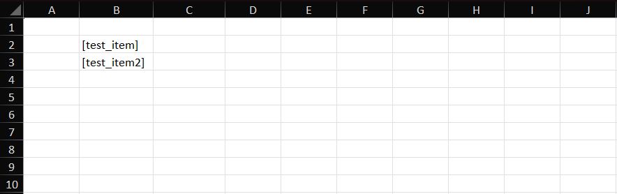
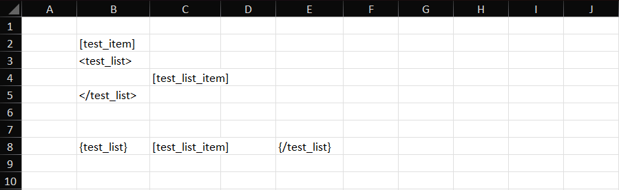
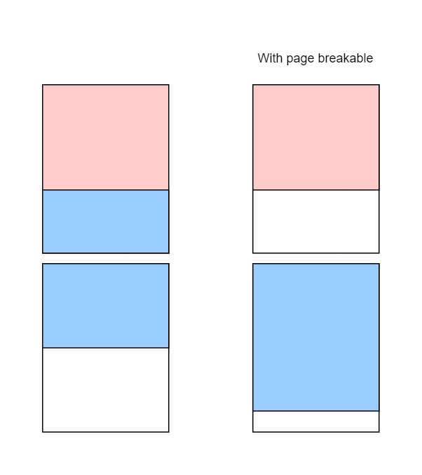
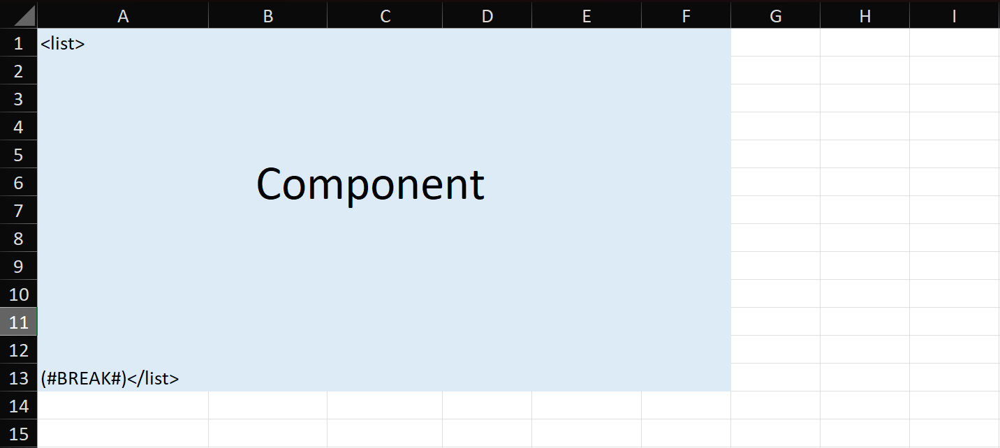
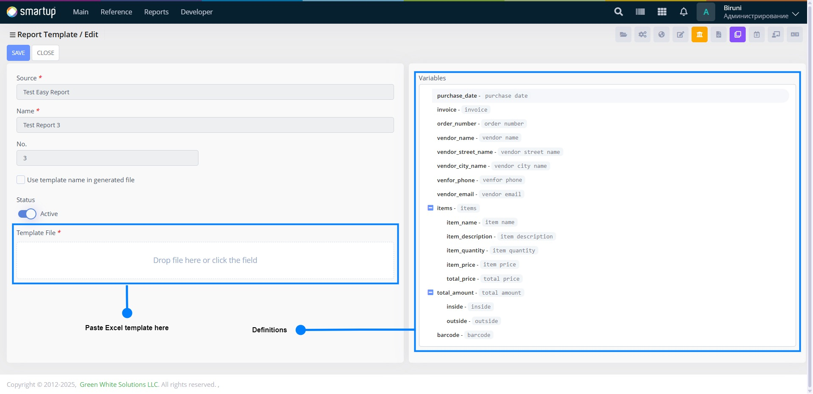

# Easy report

Easy Report is a customizable, user-friendly, template-based reporting tool. Users can define their own report templates in Excel using specified keywords, allowing for personalized report generation based on the provided template.

Easy report consists of three main components as shown below:

<figure><figcaption></figcaption></figure>

Both **"Data"** and **"Definitions"** are written in PL/SQL within UI packages. In contrast, the **"Template"** is an Excel document that utilizes keywords from **"Definitions"**. During report generation, these keywords are replaced with corresponding **"Data"** values.

## Definitions

It is necessary to first define the definitions based on business logic. A **definition** is a part of Easy Report that contains similar map objects that have `key`, `definition` and `items` fields:

* **key** — The map key used for integration with actual data.
* **definition** — The name or description of the current item.
* **items** — (Optional) Used when the object has child definitions, each with its own `key`, `definition`, and `items`.

```json
[
    // example without items field
    {
        "key": "test_key",
        "definition": "Test Key"
    },
    // example with items field
    {
        "key": "test_items_key",
        "definition": "Test Items Key"
        "items": [
            {
                "key": "test_child_key",
                "definition": "Test Child Key"
            }
        ]   
    }
]
```


The definition's hierarchical structure can reach any depth via `items` field.


The Definition fucntion should return `Arraylist`:

```plsql
Function Definitions return Arraylist is
    /*
       variables
    */
    result Arraylist := Arraylist;
begin
    /*
       inserting definition item into the result
    */
    return result;
end;
```

### Inserting item into definition

Since **"Definitions"** is an array of similar map objects, each map object can be inserted using following procedure:

```plsql
Procedure Put
(
    p_List       in out nocopy Arraylist,
    i_Key        varchar2,
    i_Definition varchar2,
    i_Items      Arraylist := null
) is
    v_Map Hashmap := Hashmap;
begin
    v_Map := Fazo.Zip_Map('key', i_Key, 'definition', i_Definition);

    if i_Items is not null then
        v_Map.Put('items', i_Items);
    end if;
    
    p_List.Push(v_Map);
end;
```

Additionally, child items can also use this procedure since they follow the same structure.

## Data

Definition keywords have been created based on business logic, and data must now be provided for each keyword. Without this, the creation of such definition keywords would serve no purpose.

The main data object is `Gmap` data type and contains values associated with each definition keyword. Three types of data can be attached to the keywords: scalar, list, image.

### Scalar data

PL/SQL scalar data types include VARCHAR2, BOOLEAN, NUMBER, DATE, and others. These data types can be easily assigned using the `put` member method of the `Gmap` type, as shown below:

<pre class="language-plsql"><code class="lang-plsql">---- declare
<strong>v_data Gmap := Gmap;
</strong>---- body
v_data.put('test_varchar2', 'test_data'); -- varchar2
v_data.put('test_number', 10);            -- number
v_data.put('test_date', sysdate);         -- date
</code></pre>


Gmap does not support assigning `boolean` to the key.


### List data

If a definitions item contains an `items` field, it should be treated as list data. Each entry within the items field is itself a definition, meaning it is also `Gmap` data type.

List consists of `Gmap` objects, and this list itself represented by the `Glist` data type.

```plsql
---- declare
v_data      Gmap := Gmap;
v_list      Glist := Glist;
v_list_item Gmap;
---- body
-- first list item
v_list_item := Gmap;
v_list_item.put('item_1_1', 'test_data');
v_list_item.put('item_1_2', 'test_data');
v_list_item.put('item_1_3', 'test_data');
v_list.push(v_list_item.Val);
-- second list item
v_list_item := Gmap;
v_list_item.put('item_2_1', 'test_data');
v_list_item.put('item_2_2', 'test_data');
v_list.push(v_list_item.Val);

data.put('test_list', v_list);
```

### Image data

Easy Report supports three types of image data:

* photo
* barcode
* qrcode

To use image data, a `Gmap` object must be assigned to a keyword with specific fields.

```plsql
---- declare
v_data    Gmap := Gmap;
v_photo   Gmap := Gmap;
v_barcode Gmap := Gmap;
v_qrcode  Gmap := Gmap;
---- begin
-- photo
v_photo.put('type', 'photo');          -- required for photo
v_photo.put('value', /* sha256 */);    -- sha hashcode of image
-- barcode
v_barcode.put('type', 'barcode');      -- required for barcode image
v_barcode.put('value', /* input */);   -- input source generated into barcode
v_barcode.put('width', /* number */);  -- width of the barcode image
v_barcode.put('height', /* number */); -- height of the barcode image
-- qrcode
v_barcode.put('type', 'qrcode');       -- required for qrcodeimage
v_barcode.put('value', /* input */);   -- input source generated into qrcode
v_barcode.put('width', /* number */);  -- width of the qrcode image
v_barcode.put('height', /* number */); -- height of the qrcode image

v_data.put('test_photo', v_photo);
v_data.put('test_barcode', v_barcode);
v_data.put('test_qrcode',, v_qrcode);
```

The default width and height for all image types are set to `200`.

## Template

Template is an Excel sheet that uses definition keywords and symbols to access the data. There are special symbols for data output, loops and page breaks.

### Data access

Square brackets `[ ]` are used for data access. Inside the brackets, a definition keyword is required. If a definition item contains child items, another symbols should be used to iterate through its data.

#### Example:

Definitions:

<pre class="language-json"><code class="lang-json"><strong>[
</strong>  {
    "key": "test_item",
    "definition": "Test Item"
  },
  {
    "key": "test_item2"
    "definition": "Test Item 2"
  }
]
</code></pre>

Template usage:

<figure><figcaption></figcaption></figure>

### Vertical and horizonal loops

Vertical and horizontal loops are used to iterate through list data using specific symbols:

* `<keyword>` opens a vertical loop, and `</keyword>` closes it.
* `{keyword}` opens a horizontal loop, and `{/keyword}` closes it.

#### Limitations

* Loops function only for definitions containing an `items` field.
* Both horizontal and vertical loops can be nested within a vertical loop, but loops are not allowed inside a horizontal loop.
* Child loops must be closed before their parent loop.

#### Example:

Definitions:

<pre class="language-json"><code class="lang-json"><strong>[
</strong>  {
    "key": "test_item",
    "definition": "Test Item"
  },
  {
    "key": "test_list",
    "definition": "Test List"
    "items": [
      {
        "key": "test_list_item",
        "definition": "Test List Item"
      }
      // can be more items here
    ]
  }
]
</code></pre>

Template usage:

<figure><figcaption></figcaption></figure>

### Page breakables

Page breakable ensures that content is properly divided based on page size in an Excel sheet. It prevents unintended separation of components across pages, keeping related elements together, as illustrated in the image:

<figure><figcaption></figcaption></figure>

The special keyword `(#BREAK#)` is used to enable this feature. You can place this keyword in any cell. If `(#BREAK#)` is placed inside a loop item, it will apply to each item within the loop.


Currently, the page breakable feature applies only to rows.


#### Example usage:

<figure><figcaption></figcaption></figure>

## Usage



#### Create a form

Create a form with "Access position" set to "Document report" and the "Easy Report" checkbox enabled. When "Easy Report" is enabled in the form info, the form requires the `:definitions` route.



#### Create a UI package for the form



#### Create the necessary route actions in the package:

There are two actions should be created in the UI package:

1. Function that returns definitions. The function should be attached to `:definitions` route.
2. Procedure that executes easy report generation

**Generating easy report**

<pre class="language-plsql"><code class="lang-plsql">Uit_Ker.Run_Report(i_Template_Id => /* Template id (number) */,
<strong>                   i_Data        => /* Gmap data */,
</strong><strong>                   /* parameters */);
</strong></code></pre>

`i_Template_Id`, and `i_Data` parameters are required, but all the other ones are optional

<table><thead><tr><th width="261">Parameter</th><th width="102">Data type</th><th>Description</th></tr></thead><tbody><tr><td>i_Template_Id</td><td><code>number</code></td><td>Accepts , gets template by its id</td></tr><tr><td>i_Data</td><td><code>Gmap</code></td><td>Data source for report generation. Complete information is provided <a href="easy-report.md#data">here</a>.</td></tr><tr><td>i_File_Name</td><td><code>varchar2</code></td><td>File name when downloaded</td></tr><tr><td>i_Check_Access</td><td><code>boolean</code></td><td>User access can be controlled if set <code>true</code></td></tr><tr><td>i_Is_Pdf</td><td><code>boolean</code></td><td>Generates a PDF file instead of a standard Excel file if LibreOffice is installed on the application server.</td></tr><tr><td>i_View_Mode</td><td><code>boolean</code></td><td>stands for the enabling or disabling the onlyoffice service. When it is set to <strong><code>true</code></strong> easy-report returns inline view on the browser via onlyoffice service.</td></tr><tr><td>i_Embedded</td><td><code>boolean</code></td><td>Minified/embedded mode of the OnlyOffice service. When set to <code>true</code>, Easy Report returns a minified inline view in the browser via the OnlyOffice service. Works when <code>i_View_Mode</code> is set to <code>true</code>.</td></tr></tbody></table>



#### Create report template

`Ker_Core.Head_Template_Save` procedure creates report template.

```plsql
declare
  v_Company_Head number := Md_Pref.Company_Head;
  v_Form         varchar2(200) := /* form path */;
  v_Name         varchar2(200 char) := /* name of the template */;
  v_Pcode        varchar2(20) := /* (e.g. biruni:1) */;
begin
  Ui_Auth.Logon_As_System(v_Company_Head); -- login first
  Ker_Core.Head_Template_Save(i_Form     => v_Form,
                              i_Name     => v_Name,
                              i_Order_No => /* order in the list (number) */,
                              i_Pcode    => v_Pcode);
  commit;
end;
```

After executing the code, the template report will be inserted into `ker_templates` table. In order to modify the templates go to `/biruni/ker/head_template_list` form. Select the template that you have added then click edit button.

<figure><figcaption></figcaption></figure>


