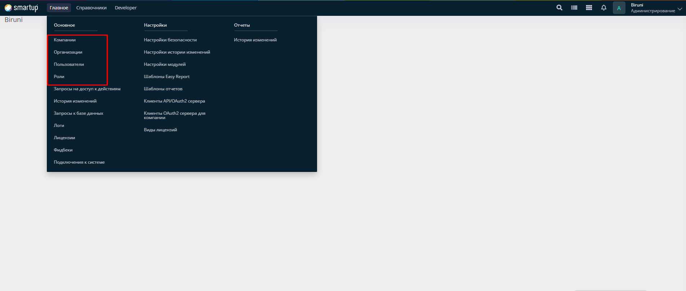

# Basic Concepts

The Biruni Framework is a robust system for developing business logic directly within Oracle Database. This architecture allows developers to create, manage, and expose business logic through a well-defined routing mechanism, making it accessible via HTTP requests. This document outlines the core concepts and components of the Data/Business Logic layer within the Biruni Framework.

## Basics

The Biruni application includes several fundamental forms for managing companies,organizations, users, roles and more.

<figure><figcaption><p>main menu</p></figcaption></figure>

<table data-full-width="false"><thead><tr><th width="171">Entity name</th><th width="270">Description</th><th>form path</th></tr></thead><tbody><tr><td><strong>Company</strong></td><td>Manages company-related data and configurations</td><td>/biruni/md/company_list</td></tr><tr><td><strong>Organization</strong></td><td>Handles branch information within a company</td><td>/biruni/md/filial_list</td></tr><tr><td><strong>User</strong></td><td>Manages user accounts and their associated details</td><td>/biruni/md/user_list</td></tr><tr><td><strong>Role</strong></td><td>Defines user roles and permissions within the system</td><td>/biruni/md/role_list</td></tr></tbody></table>

As you can see, the path includes the project code, module code, and the path to the HTML file within the module folder.

`<project_code>/<module_code>/<path to html file>`

```
📁 biruni/
├── 📁 main/
    ├── 📁 oracle/
    │   ├── 📁 module/
    │   │   ├── 📁 md/
    │   │       └── <md module files>
    │   ├── 📁 ui/
    │       ├── 📁 md /
    │           ├── company_list.pck
    │           ├── filial_list.pck
    │           ├── role_list.pck
    │           ├── user_list.pck
    │           └── <other md ui packages>
    ├── 📁 page/
         ├── 📁 form/
             ├── 📁 biruni/
                 ├── 📁 md/
                     ├── company_list.html
                     ├── filial_list.html
                     ├── role_list.html
                     ├── user_list.pck
                     └── <other md ui html files>
```

## Key Components

The Data/Business Logic layer in Biruni consists of two primary components:

* **Module Files** - Core business logic components
* **UI Packages** - Interface layer for data access and manipulation

These components work together to provide a complete solution for implementing business requirements while maintaining separation of concerns.

```
📁 task_manager/
├── 📁 main/
    ├── 📁 oracle/
        ├── 📁 module/
        │   ├── 📁 <module code>/
        │       └── <module files>
        ├── 📁 ui/
        │   └── 📁 <module code>/
        │       └── <ui packages of module>
        ├── 📁 uit/
            └── <uit packages>    
```

## Data Flow Overview

The typical flow of data in the Biruni Framework follows this pattern:

1. External requests are received through the Biruni Routing Mechanism
2. Requests are routed to appropriate UI packages
3. UI packages may directly query tables or use Module packages
4. Module packages handle core business operations (insert, update, delete)
5. Results are returned through the routing mechanism
