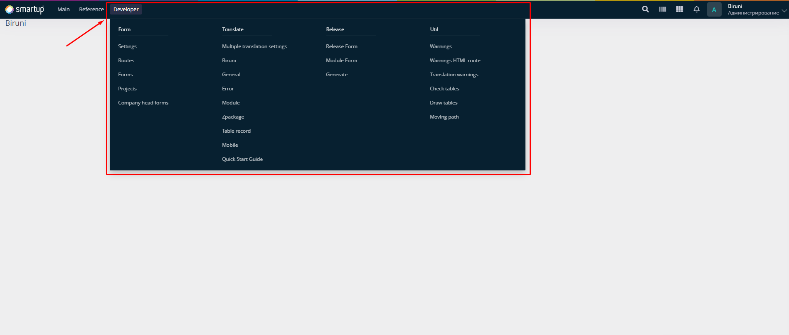

# Dev module

The **Dev module** in the Biruni framework provides a suite of tools and functionalities designed to streamline development, manage application components, and ensure smooth deployment processes. However, to access and use the **Dev module**, the application must be running in **Dev mode**. Accessible via the **Developer menu**, this module empowers developers to configure routes, manage permissions, handle translations, oversee releases, and monitor warnings—all within a unified interface. Below is an overview of its key features and how developers can utilize them.

### Accessing the Developer Module

The Developer module is accessed through the Developer menu, which organizes its functionalities into four main groups:

* **Form**: Manage forms, routes, and their accessibility.
* **Translate**: Handle multilingual support and system translations.
* **Release**: Control the release process for forms and components.
* **Util**: Monitor and resolve development warnings.

<figure><figcaption>
Developer menu
</figcaption></figure>

### Using the Developer Module

To effectively use the Developer module, follow these steps:

1. **Run Setup Script**: Execute the script located at `biruni/main/oracle/dev/make_dev.sql` in a developer schema to unlock full development capabilities and bypass specific restrictions.
2. **Navigate the Developer Menu**: Access the four groups—Form, Translate, Release, and Util—via the Developer menu to utilize all available features.
3. **Configure Components**: Define projects, modules, forms, paths, and their properties as required for your application, using the tools provided in each group.


The **make\_dev.sql** script must be executed only in a development environment to avoid unintended changes or security risks in production.


The Developer module integrates seamlessly with the Biruni framework, offering a robust environment for building, testing, and deploying applications. By leveraging the **make\_dev.sql** script and the Developer menu, developers can efficiently manage the development lifecycle.
