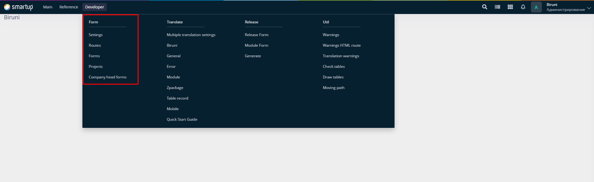

# Form

The **Form** group focuses on configuring and managing forms, routes, and their accessibility within the Biruni framework. It provides developers with a comprehensive set of tools to build, organize, and secure application interfaces.&#x20;

<figure><figcaption>
Form group
</figcaption></figure>

The group is divided into 5 sections:

1. **Settings**&#x20;
2. **Routes**
3. **Forms**&#x20;
4. **Projects**
5. **Company Head Forms**

&#x20;Each section offers specific functionalities to streamline development tasks.
