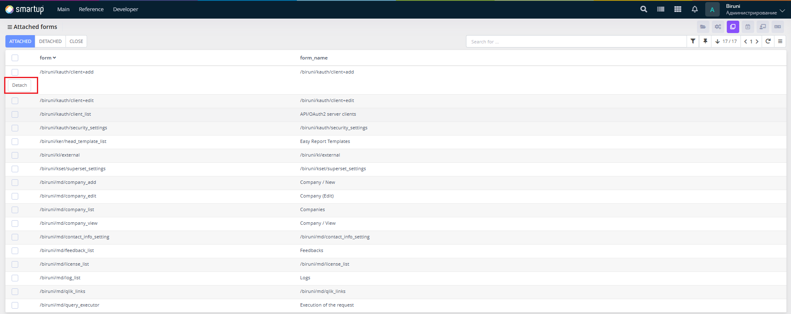

---
layout:
  title:
    visible: true
  description:
    visible: false
  tableOfContents:
    visible: true
  outline:
    visible: true
  pagination:
    visible: true
---

# Company head forms

Define and manage forms accessible only to company heads, enforcing strict access controls for sensitive or high-level functionality.

<figure><figcaption>
Company head forms
</figcaption></figure>

Through the Company Head Forms form, developers can:

* Use the interface to search for forms, view a list of forms restricted to authorized company head personnel in a tabular format, and manage forms (e.g., attach or detach forms via the **Attached**/**Detached** buttons).
* Ensure access is limited to prevent unauthorized use, protecting critical application features, by maintaining these forms exclusively for company heads.

This section provides tools to safeguard sensitive functionality within the application.
