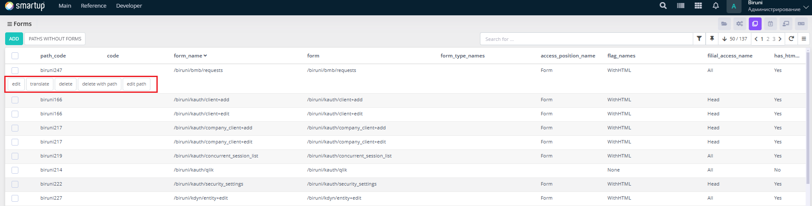
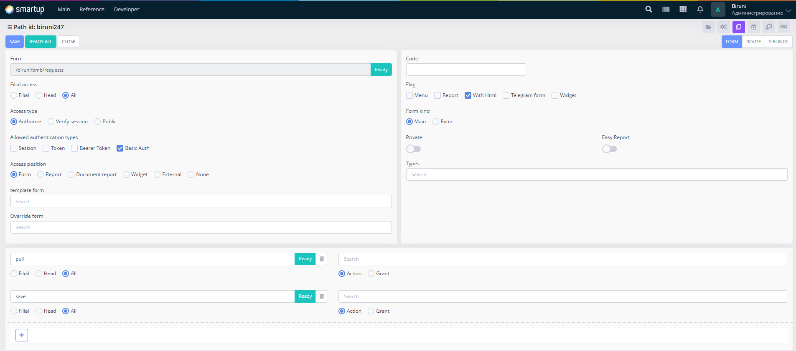

---
layout:
  title:
    visible: true
  description:
    visible: false
  tableOfContents:
    visible: true
  outline:
    visible: true
  pagination:
    visible: true
---

# Forms

Register and manage forms to ensure they are properly integrated and accessible within the application.

<figure><figcaption>
Forms
</figcaption></figure>

Through the Forms form, developers can:

* Use the interface to search for forms, view a list of forms and their paths in a tabular format, and perform actions like deleting forms (via the **Delete** button) or deleting forms with their paths (via the **Delete with Path** button).
* Add new forms or edit existing ones (via **Add** or **Edit** buttons), which opens the **add**/**edit** form for configuration.

<figure><figcaption>
editing form
</figcaption></figure>

In the add/edit form, developers can:

* Input the form path (e.g., /biruni/bmb/requests, /biruni/kauth/client-add).
* Choose filial access options (Filial, Head, All).
* Set access types (Public, Verify Session, Authorize).
* Select allowed authentication types (Session, Token, Bearer Token, Basic Auth).
* Define the access position (Form, Report, Document Report, Widget, External, None).
* Configure flags (e.g., WithHTML, Menu, Report, Telegram, Widget).
* Set additional properties such as form kind (Main, Extra), private status (toggle), and easy report status (toggle).
* Specify a template form, override form, and search fields as needed.
* Add routes to the form by navigating to the ROUTE tab in the top-right corner, where developers can configure route-specific details.
* Create sibling forms by using the SIBLING tab, allowing developers to define related forms for contextual grouping.

This section enables developers to create and manage the core user interface elements effectively.
