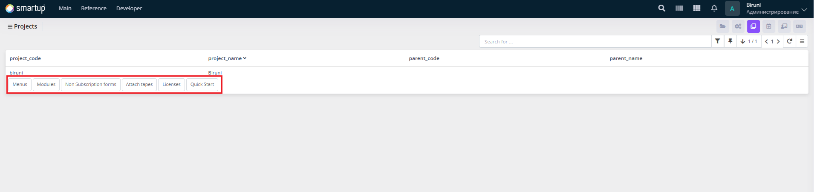

# Projects

Organize forms into projects to structure and manage application components systematically.&#x20;

<figure><figcaption>
Projects
</figcaption></figure>

Through the **Projects** form, developers can:

* Use the interface to search for projects, view a list of project codes, names, and parent relationships in a tabular format.
* Manage project components such as menus, modules, non-subscription forms, attached tapes, licenses, and quick start guides by navigating to specific tabs or forms within the project (e.g., via buttons like "Menus," "Modules," "Non-Subscription Forms," "Attach Tapes," "Licenses," "Quick Start").

In the project management forms (e.g., **Menus**, **Modules**, **Non-Subscription Forms**, **Attached Tapes**, **Licenses**, **Quick Start Guide**), developers can:

* **Menus**: Add new menus or edit existing ones (via **Add** or **Edit** buttons), specify menu names (e.g., "Main," "Reference"), and set order numbers (e.g., 1, 2) to organize navigation hierarchies.
* **Modules**: Add new modules or edit/delete existing ones (via **Add**, **Edit**, or **Delete** buttons), input **module codes** (e.g., "dev"), **names**, and **visibility** settings (e.g., "Yes," "No"). Bind forms to modules using the **Bind Forms** button.
* **Non-Subscription Forms**: View, attach, or detach forms (via Attached/Detached buttons) to manage forms not requiring subscriptions.
* **Attach Tapes**: View, attach, or detach tapes for mobile applications.
* **Licenses**: View license codes, names, kinds, module codes, and setting forms.
* **Quick Start Guide**: Add or edit text content and associate forms (e.g., `/biruni/bmb/requests`, `/biruni/kauth/client-add`) with the guide.

This section supports developers in building modular and scalable application architectures.

