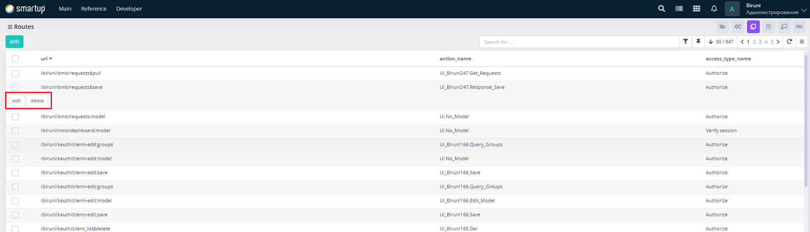
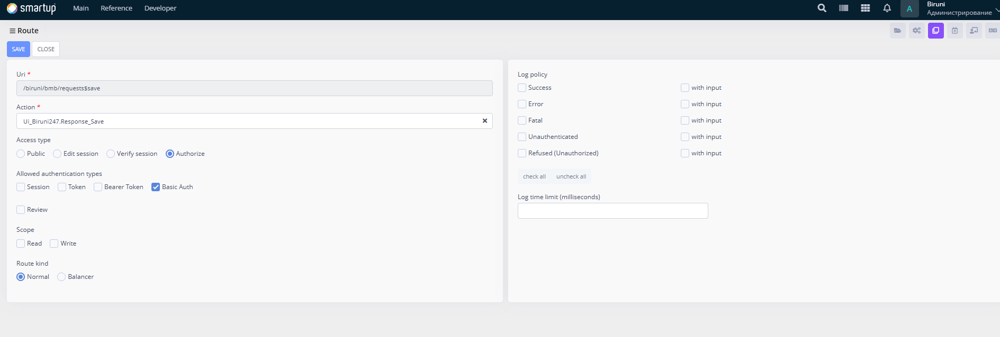

# Routes

Define and manage system paths to create a structured navigation system within the application.

<figure><figcaption>
Routes
</figcaption></figure>

Through the **Routes** form, developers can:

* Use the interface to search for routes.
* View a list of URIs in a tabular format.
* Perform actions like deleting routes (via the **Delete** button in the list view).
* Adding new routes or editing existing ones (via **Add** or **Edit** buttons) opens a form for configuration.

<figure><figcaption>
editing route
</figcaption></figure>

In the **add**/**edit** form, developers can configure additional details such as:

* Specify system paths (e.g., `/biruni/bmb/requests$pull`, `/biruni/bmb/requests:model`)  in the **URI** field
* Link **routes** to **procedures** such as UI\_Biruni247.Get\_Requests and UI\_No\_Model to handle route-specific logic, set up in the **Action** field.
* **Access types** (Public, Verify Session, Authorize).
* **Allowed authentication types** (Session, Token, Bearer Token, Basic Auth).
* **Scope** (Read, Write).
* **Route kind**(Normal, Balancer).
* **Log policies** (e.g., Success, Error, Fatal, Unauthenticated, Refused(Unauthorized)).

This section is essential for building and maintaining a robust routing system for the application.
