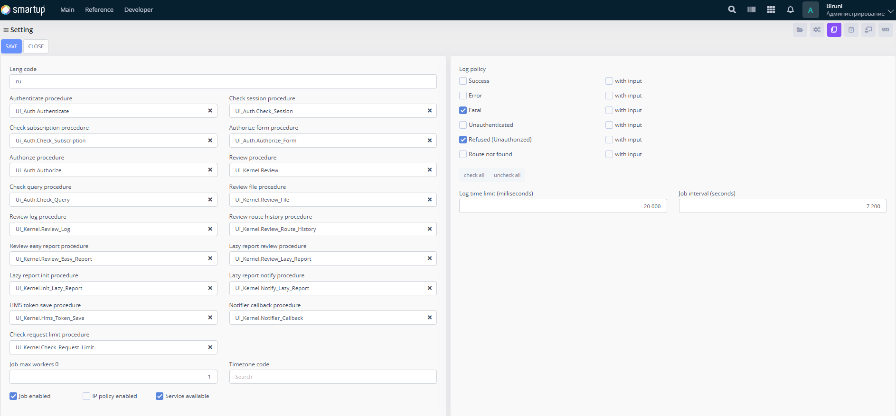

---
layout:
  title:
    visible: true
  description:
    visible: false
  tableOfContents:
    visible: true
  outline:
    visible: true
  pagination:
    visible: true
---

# Settings

Configure general settings for the application, including authentication, authorization, and logging procedures.

<figure><figcaption>
Settings
</figcaption></figure>

Through the **Settings** form, developers can:

* Define and edit the **language code** (e.g., ru) to ensure proper localization and language handling across the application.
* Define, set up, and edit **authentication**/**authorization** procedures (e.g., UI\_Auth\_Authenticate, UI\_Auth\_Check\_Session, UI\_Auth\_Authorize\_Form, UI\_Auth\_Check\_Subscription), **check query procedures** (e.g., UI\_Auth\_Check\_Query), and **review procedures for logs**, **routes**, **files**, **lazy reports**, and **HMS token management** (e.g., UI\_Kernel\_Review\_Log, UI\_Kernel\_Review\_Route\_History, UI\_Kernel\_Hms\_Token\_Save) to manage user access, verify sessions, check subscriptions, and handle related tasks.
* Configure **log policies** by selecting options like Success, Error, Fatal, Unauthenticated, or Refused, and toggle whether **logs include input** (using checkboxes for each policy).
* Adjust **log time limits** (in milliseconds, e.g., 20,000) and **job intervals** (in seconds, e.g., 7,200) to optimize performance and scheduling.
* Enable or disable features such as **IP policy**, **jobs** (with a max worker count, e.g., 1), or **service availability** via checkboxes or toggles.
* Set the **timezone code** to ensure proper time handling across the application.

This section ensures developers can fine-tune the application’s core settings for secure and efficient operation.
