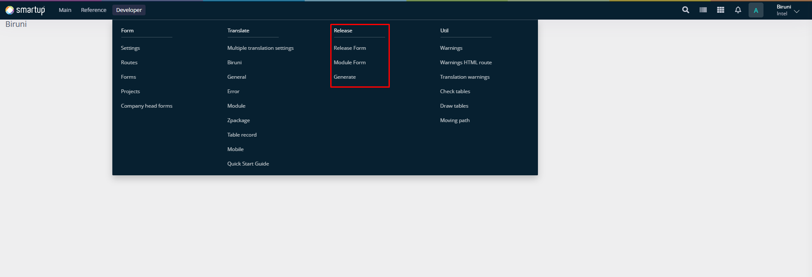

# Release

The Release group handles the preparation and deployment of application components, ensuring a controlled and reliable release process.

<figure><figcaption>
Release group
</figcaption></figure>

The group is divided into 3 sections:

* **Release Form**
* **Module Form**
* **Generate**

This group ensures a controlled and reliable release process for application components.
