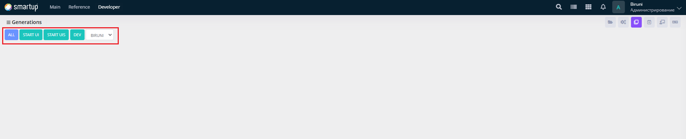

---
layout:
  title:
    visible: true
  description:
    visible: false
  tableOfContents:
    visible: true
  outline:
    visible: true
  pagination:
    visible: true
---

# Generate

Automatically generate release files or configurations for forms and modules, streamlining the deployment process.

<figure><figcaption>
Generate
</figcaption></figure>

Through the **Generate** form, developers can:

* Use the interface to select a project (e.g., BIRUNI) from a dropdown menu and initiate the generation of SQL files for deployment using the following buttons:
  * **ALL**: Generates all SQL files required for release, covering forms, modules, and configurations.
  * **START\_UI**: Generates the start\_ui.sql file, preparing the initial UI setup for deployment.
  * **START\_UIS**: Generates multiple SQL files, including menu.sql, company\_head\_form.sql, tape.sql, translate\_code.sql, and start\_uis.sql, to configure menus, forms, and translations for deployment.
  * **DEV**: Generates the dev\_setting.sql file, focusing on development-specific settings for deployment.
* These generated SQL files can be executed in a production environment to complete the release process.
