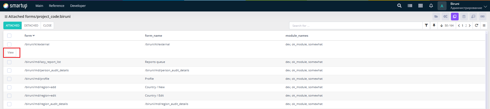
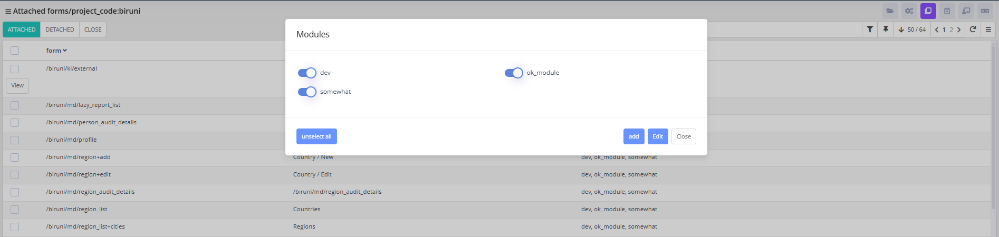

# Module Form

Manage the release of forms grouped within modules, ensuring module-specific components are deployed correctly.

<figure><figcaption>
Module Form
</figcaption></figure>

<figure><figcaption>
Module Form -> biruni
</figcaption></figure>

<figure><figcaption>
Module Form -> biruni[view]
</figcaption></figure>

Through the **Module Form**, developers can:

* manage module-specific forms by attaching or detaching them (via **Attach** or **Detached** buttons), and view details by clicking the **View** button for each row, which opens a modal window. The modal displays module options (e.g., dev, ok\_module, somewhat) with toggle switches to select or deselect modules, and provides actions like **unselect al**l, **add**, **edit**, and **close** to configure the release settings.
