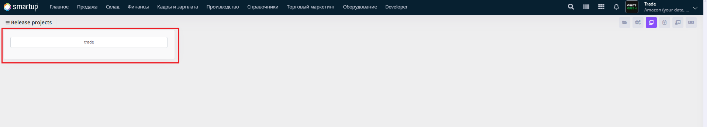
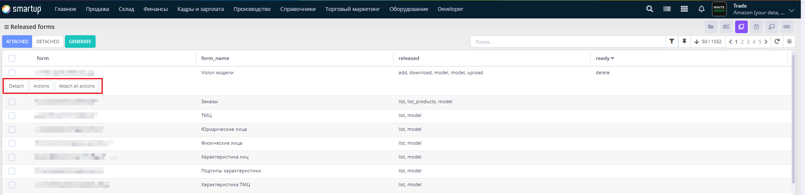

# Release Form

Mark individual forms as ready for release, specifying associated actions to prepare them for production deployment.&#x20;

<figure><figcaption>
Release Form
</figcaption></figure>

<figure><figcaption></figcaption></figure>

Through the **Release Form**, developers can:

* In the Released forms view, manage individual forms by marking them as ready, attaching or detaching forms (via "Attached" or "Detached" buttons), and generating release.sql (via "Generate" button).
* Note: Since the Release Form for the Biruni framework's own project (biruni) is hidden, this functionality is demonstrated using another project built on the Biruni Framework, illustrating how developers can manage form releases in similar environments.

This ensures individual forms are properly prepared and deployed.
