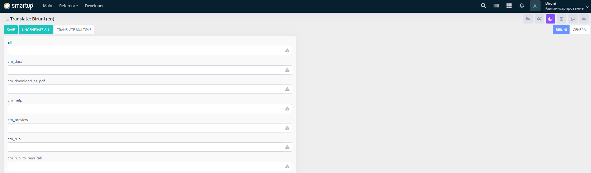

---
layout:
  title:
    visible: true
  description:
    visible: false
  tableOfContents:
    visible: true
  outline:
    visible: true
  pagination:
    visible: true
---

# Biruni

Manage translations for messages used in the **Biruni web UI**, which are sourced from **dev\_pref.pck** with default English translations written in `biruni/main/web/biruni/constants/langs.js`

<figure><figcaption>
Biruni
</figcaption></figure>

Through the **Biruni** form, developers can:

* Use the interface to view and manage a list of translation keys or phrases (e.g., cm\_data, cm\_download\_as.pdf, cm\_help) in a tabular format.
* Edit or translate individual translation entries by clicking on them or use the **Translate Multiple** button to handle multiple translations simultaneously.
* Generate or ungenerate translations for all entries using the **Ungenerate All** and **Translate Multiple** buttons to streamline the localization process.

This enables developers to localize BIruni-specific elements effectively.
