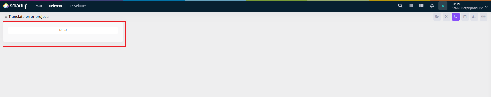
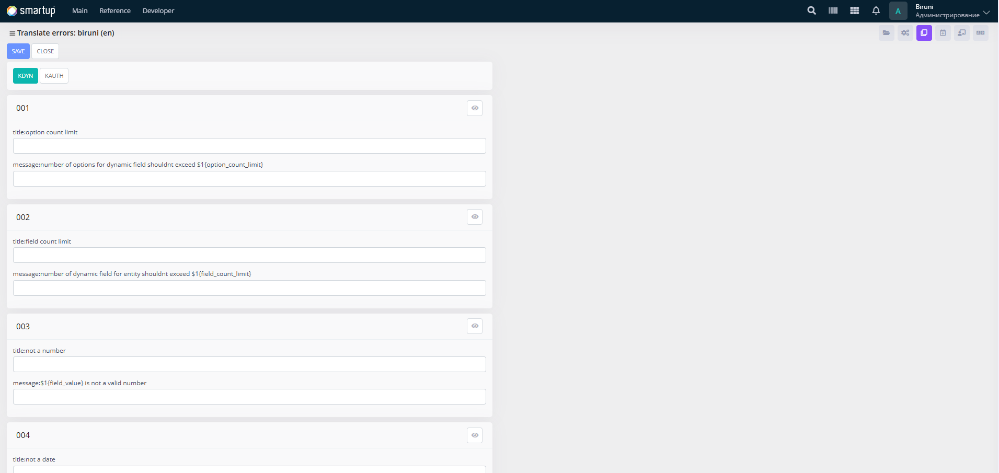

---
layout:
  title:
    visible: true
  description:
    visible: false
  tableOfContents:
    visible: true
  outline:
    visible: true
  pagination:
    visible: true
---

# Error

Address and translate error messages or warnings to ensure clear communication in all supported languages

<figure><figcaption><p>Error</p></figcaption></figure>

<figure><figcaption><p>Error -> biruni</p></figcaption></figure>

Through the **Error** form, developers can:

* Use the interface to view and manage a list of error codes and their associated messages in a tabular format, with module-specific sections (e.g., KDYN, KAUTH) to organize translations.
* Edit error details by inputting titles (e.g., _titledrop count limit_) and messages (e.g., _number of options shouldn't exceed $1_, where $1{option\_count\_limit} represents a dynamic value provided by the system, described by its context)

This ensures users receive understandable error messages regardless of language.

## **Adding New Error to Translate**

Developers can add new error messages for translation using the **Raise\_Extended** procedure, which is located inside the **b** package. The procedure allows for adding errors with solutions, requiring specific formatting for titles, messages, and solutions.

* **Procedure 1**:
  * Use this procedure to raise an error with an array of solutions.

<pre class="language-plsql" data-title="b.pck"><code class="lang-plsql"><strong>Procedure Raise_Extended
</strong>(
  i_Code      varchar2,
  i_Message   varchar2,
  i_Title     varchar2,
  i_Solutions Array_Varchar2
);
</code></pre>

* **Procedure 2**:
  * Use this procedure to raise an error with up to five individual solutions.


```plsql
Procedure Raise_Extended
(
  i_Code    varchar2,
  i_Message varchar2,
  i_Title   varchar2 := null,
  i_S1      varchar2 := null,
  i_S2      varchar2 := null,
  i_S3      varchar2 := null,
  i_S4      varchar2 := null,
  i_S5      varchar2 := null
);
```


### Example

```plsql
b.Raise_Extended(
  i_Code    => 'A01-02' || '001',
  i_Title   => b.Translate('KAUTH:' || '001:title:no Qlik license'),
  i_Message => b.Translate('KAUTH:' || '001:message:current user has no qlik license attached'),
  i_S1      => b.Translate('KAUTH:' || '001:solution:attach qlik license to current user'),
  i_S2      => b.Translate('KAUTH:' || '001:solution:attach current user to filials')
);
```

* In this example:
  * **'A01-02'** is the KAUTH module error code.
  * **'001'** is the unique error code within the KAUTH module.
  * **i\_Title**, **i\_Message**, **i\_S1**, **i\_S2**, etc., must start with the **module code** and **error code** (e.g., KAUTH:001:), followed by:
    * **title**: for the title text (e.g., no Qlik license).
    * **message**: for the message text (e.g., current user has no qlik license attached).
    * **solution**: for each solution text (e.g., attach qlik license to current user), separated by colons (:).

This allows developers to configure new error messages with solutions for translation, ensuring clear multilingual error communication.
