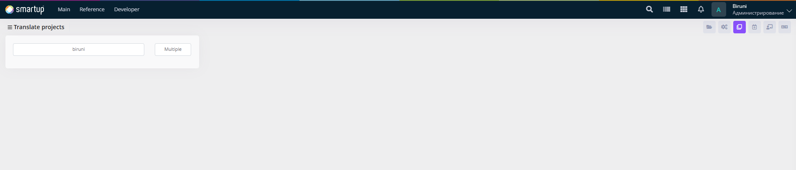
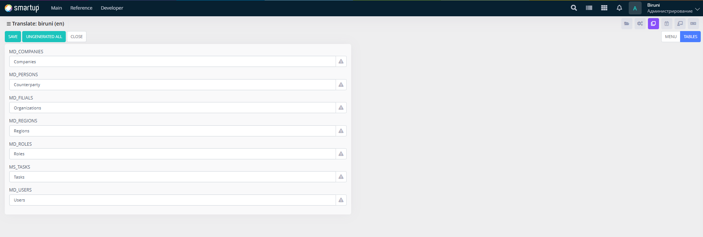

# General

Handle general translation tasks for standard application elements.

<figure><figcaption>
General
</figcaption></figure>

<figure><figcaption>
General -> biruni [MENU]
</figcaption></figure>

<figure><figcaption>
General -> biruni [TABLES]
</figcaption></figure>

&#x20;Through the **General form** (Translate: projects), developers can:

* &#x20;Use the interface to search for projects, view a list of project names (e.g., biruni) in a tabular format, and switch between single project (biruni) or multiple project (Multiple) translation modes using the interface options.

This supports broad localization of common application features.
