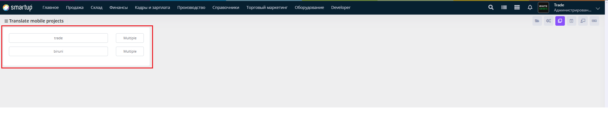
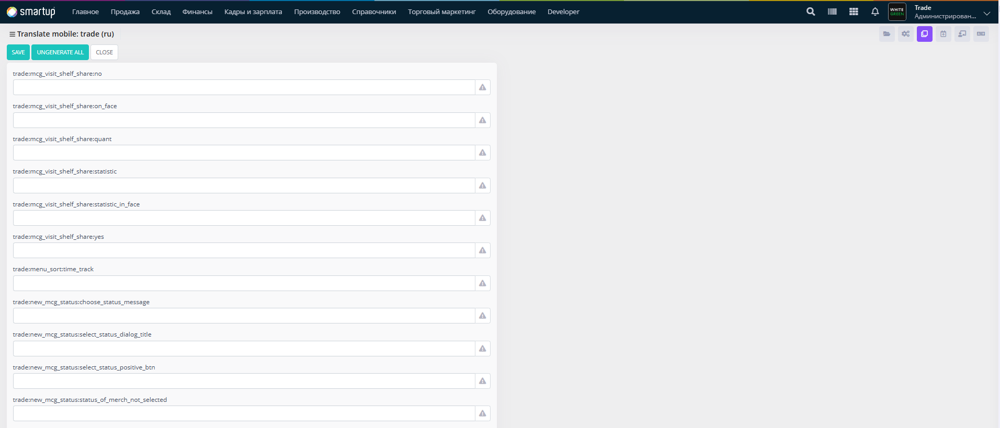

# Mobile

Configure translations for mobile-specific interfaces or applications.

<figure><figcaption><p>Mobile</p></figcaption></figure>

<figure><figcaption><p>Mobile -> trade</p></figcaption></figure>

Through the **Mobile** form, developers can:

* Edit translations by inputting or modifying text for each key in text fields.
* Note: Since the Biruni Framework itself lacks mobile messages, this functionality applies to applications (e.g., trade) built with the framework, allowing developers to localize mobile interfaces accordingly.

This ensures mobile users experience localized content effectively.

## **Adding New Messages to Translate**

&#x20;Developers can add new messages for translation using the **Project\_Translate\_Code** procedure, which is located inside the **uis** package. The procedure requires specifying the **translation code** and the **project code**.

```plsql
Procedure Project_Translate_Code
(
  i_Translate_Code varchar2,
  i_Project_Code   varchar2
);
```

* **i\_Translate\_Code**: The code for the message to translate, formatted as project:module:message (e.g., trade:assortment\_detected\_items:toolbar\_title).
* **i\_Project\_Code**: The code of the project (e.g., trade).

### **Example**

```plsql
uis.project_translate_code('trade:assortment_filter:apply_btn','trade');
```

In this example, a new message with the code **trade:assortment\_filter:apply\_btn** is added for the **trade** project.

This allows developers to configure new mobile-specific messages for translation, enhancing multilingual support.
