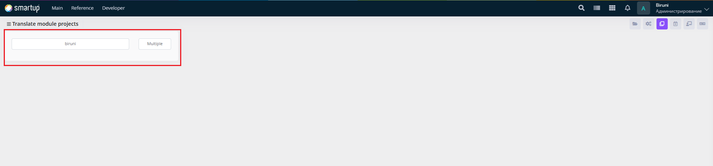
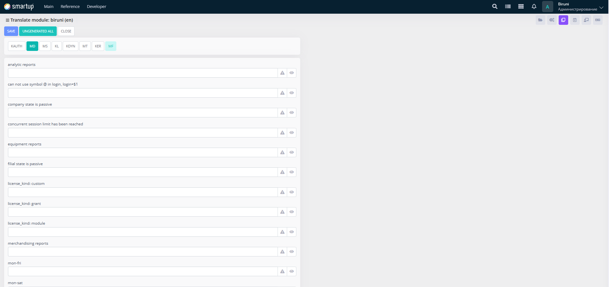

# Module

Manage translations for specific modules within projects.

<figure><figcaption><p>Module</p></figcaption></figure>

<figure><figcaption><p>Module -> biruni</p></figcaption></figure>

Through the **Module** form, developers can:

* Use the interface to view and manage a list of translation keys or phrases organized by module-specific tabs (e.g., KAUTH, MD, MS, KL, KDYN, MT, KER, MF).
* Edit translations for individual modules by inputting or modifying text in the corresponding fields, with options to expand or collapse entries for detailed viewing.

This allows for targeted localization of module-specific content.

## **Adding New Messages to Translate**

Inside the b package, developers can use the Translate functions to translate custom messages. Messages must start with the module name followed by a colon (:). The available Translate functions are:

* **Function 1**
  * Use this function to translate a message with an array of parameters and an optional language code.


```plsql
Function Translate
(
  i_Message   varchar2,
  i_Params    Array_Varchar2 := null,
  i_Lang_Code varchar2 := null
) return varchar2;
```


* **Function 2:**


```plsql
Function Translate
(
  i_Message varchar2,
  i_P1      varchar2,
  i_P2      varchar2 := null,
  i_P3      varchar2 := null,
  i_P4      varchar2 := null,
  i_P5      varchar2 := null
) return varchar2;
```


* Use this function to translate a message with up to five individual parameters.

### **Example**:

```plsql
b.Translate('TMD:' || 'Hello $1 from $2', i_P1 => 'Duck store', i_P2 => 'Biruni');
```

* In this example, the message starts with **TMD:** (indicating the module name), followed by the text **Hello $1 from $2**, where **$1** and **$2** are replaced by the parameters **Duck store** and **Biruni**, respectively.

This allows for targeted localization of module-specific content and the creation of new translated messages.
