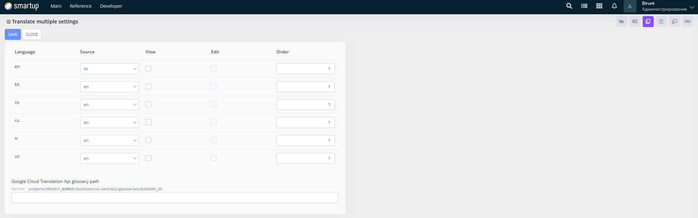

---
layout:
  title:
    visible: true
  description:
    visible: false
  tableOfContents:
    visible: true
  outline:
    visible: true
  pagination:
    visible: true
---

# Multiple Translation Settings

Configure settings for handling translations across multiple languages, ensuring consistent localization throughout the application.

<figure><figcaption>
Multiple Translation Settings
</figcaption></figure>

Through the **Multiple Translation Settings** form, developers can:

* Use the interface to view and manage a list of languages (e.g., en, kk, ro, ru, tr, uz) in a tabular format, specifying source languages and their corresponding target languages (e.g., mapping en to en, kk to kk, etc.).
* Edit language mappings by selecting source and target languages from dropdown menus, checking or unchecking "View" and "Edit" options for each language pair, and setting order numbers (e.g., 1) to prioritize translation sequences.
* Configure the default translation API glossary path (e.g., /projects/PROJECT\_NUMBER/locations/us-central1/glossaries/GLOSSARY\_ID) in a text field to integrate with external translation services.

This ensures developers can set up the foundation for multilingual support effectively.
