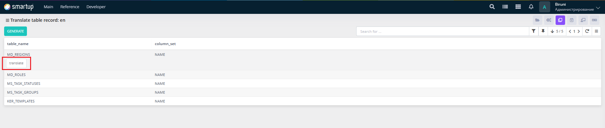
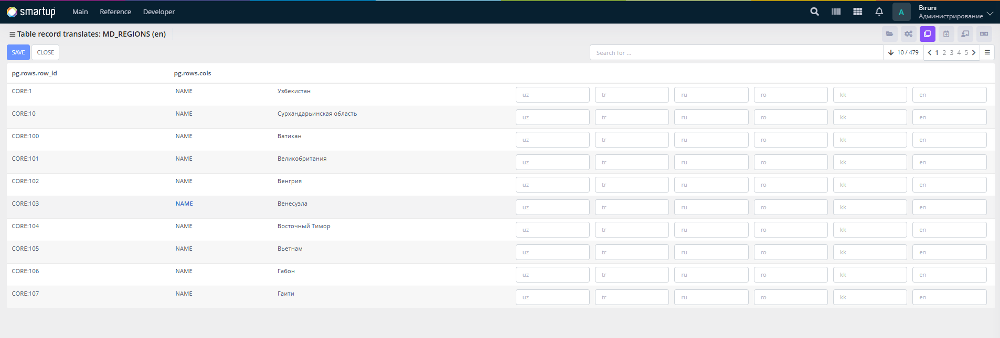

---
layout:
  title:
    visible: true
  description:
    visible: false
  tableOfContents:
    visible: true
  outline:
    visible: true
  pagination:
    visible: true
---

# Table Record

Translate table data or records for multilingual display.

<figure><figcaption><p>Table Record</p></figcaption></figure>

<figure><figcaption><p>Table Record -> translate</p></figcaption></figure>

Through the **Table Record** form, developers can:

* Use the interface to search for table records, view a list of table names (e.g., MD\_REGIONS, MD\_ROLES, MS\_TASK\_STATUSES, MS\_TASK\_GROUPS, MD\_TEMPLATES) and their column sets (e.g., NAME) in a tabular format
* In the detailed translation form, edit translations for specific records by inputting text for each language (e.g., uz, tr, ru, ro, kk, en) corresponding to row IDs (e.g., CORE:1, CORE:10) and column values.

## **Adding New Table Records to Translate**

Developers can add new table records for translation by inserting a row into the **Md\_Table\_Record\_Translate\_Settings** table. The table row requires specifying the table name and column set to be translated.

* One method to insert a row is using the **z\_Md\_Table\_Record\_Translate\_Settings.Insert\_One** function:

### Example

```plsql
z_Md_Table_Record_Translate_Settings.Insert_One(i_Table_Name  => 'tmd_departments',
                                                i_Column_Set  => 'name');
```

* **i\_Table\_Name**: The name of the table to translate (e.g., tmd\_departments).
* **i\_Column\_Set**: The column(s) to translate (e.g., name). Multiple columns can be specified, separated by commas (e.g., name,description).

This allows developers to configure new table records for translation, ensuring comprehensive multilingual support.
