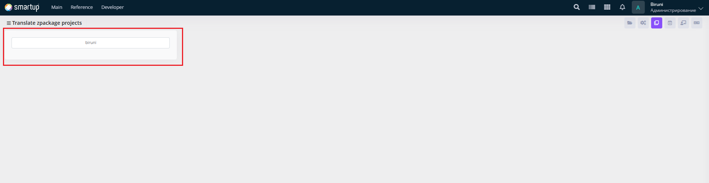
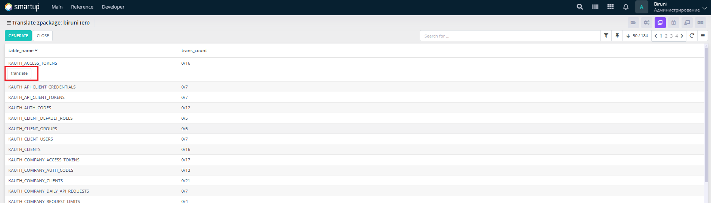
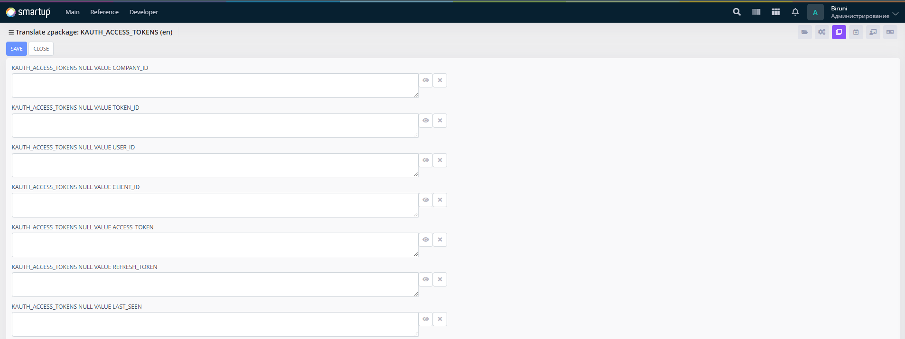

---
layout:
  title:
    visible: true
  description:
    visible: false
  tableOfContents:
    visible: true
  outline:
    visible: true
  pagination:
    visible: true
---

# Zpackage

Handle translations for package-related components or bundled features, leveraging the Z package which simplifies database operations by eliminating the need to write INSERT, UPDATE, DELETE, and SELECT queries manually.

<figure><figcaption>
Zpackage
</figcaption></figure>

<figure><figcaption>
Zpackage -> biruni
</figcaption></figure>

<figure><figcaption>
Zpackage -> biruni -> translate
</figcaption></figure>

Through the **Zpackage** form, developers can:

* Use the interface to search for package-related translation items, view a list of table names and their translation counts (e.g., 0/16) in a tabular format, and select specific packages for detailed translation.
* In the detailed translation form, edit translations by inputting or modifying text for specific fields in text fields.

This ensures package-specific translations are consistent and accurate
