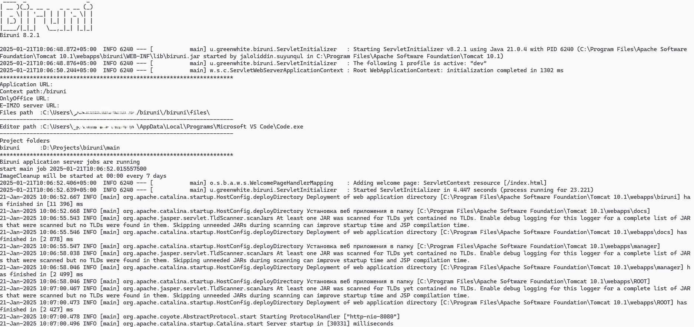
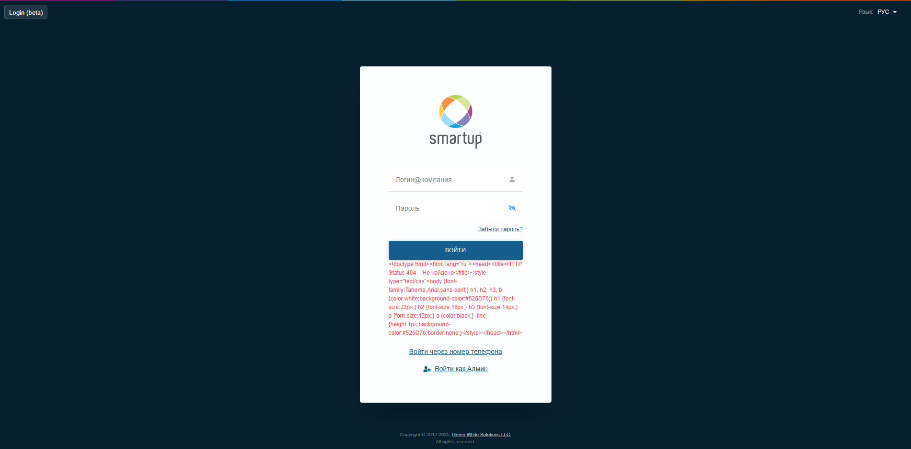

# Tomcat Deployment Guide

## Prerequisites

### Required Tools

* Oracle (v19)
* Java Development Kit (JDK v21)
* Apache Tomcat (v10)

***

## [Oracle Setup](broken-reference)

***

## Deployment Process



#### Download Project Files

From [Biruni Releases](https://github.com/greenwhite/biruni/releases) go to **Assets** section and download:

1. Choose one:
   * <mark style="color:orange;">**`app_biruni.zip`**</mark> (Production version)
   * <mark style="color:orange;">**`app_biruni_dev.zip`**</mark> (Development version)
2. <mark style="color:orange;">**`libs.zip`**</mark>



#### Application Installation

1. Deploy application
   1. Locate your tomcat directory
   2. Navigate to the <mark style="color:orange;">**`webapps`**</mark> folder
   3. Unzip <mark style="color:orange;">**`app_biruni.zip`**</mark> or <mark style="color:orange;">**`app_biruni_dev.zip`**</mark>
   4. Rename the unzipped folder to your desired project name (e.g.: "biruni"). This name will become your web application's context path in the browser URL (e.g., http://localhost:8080/biruni)
2. Install libraries
   1. Navigate to <mark style="color:orange;">**`tomcat/webapps/YOUR_PROJECT_NAME/WEB-INF/lib`**</mark>
   2. Extract contents of <mark style="color:orange;">**`libs.zip`**</mark> into this folder

```
📁 Tomcat/
├── 📁 bin/
│   ├── 📄 tomcat10.exe
│   └── ...
├── 📁 webapps/
│   ├── 📁 YOUR_PROJECT_NAME/
│   │   ├── 📁 WEB-INF/
│   │   │   ├── 📁 libs/
│   │   │   │   ├── 📄 lib1.jar
│   │   │   │   ├── 📄 lib2.jar
│   │   │   │   └── ...
│   │   │   └── 📄 web.xml
│   │   └── ...
│   └── ...
├── 📁 properties/
│   ├── 📄 YOUR_PROJECT_NAME.properties
│   └── ...
└── ...
```



#### Configuration Setup

1. Initial Tomcat configuration
   1. Navigate to <mark style="color:orange;">**`tomcat/bin/`**</mark>
   2. Run <mark style="color:orange;">**`tomcat10.exe`**</mark>
   3.  Wait for initial startup (Tomcat will begin deploying projects)

       The project will generate<mark style="color:orange;">**`YOUR_PROJECT_NAME.properties`**</mark> in Tomcat's <mark style="color:orange;">**`properties`**</mark> folder
2. Properties configuration
   1. Navigate to <mark style="color:orange;">**`tomcat/properties`**</mark>
   2. Configure <mark style="color:orange;">**`YOUR_PROJECT_NAME.properties`**</mark>:

```properties
spring.datasource.username=YOUR_SCHEMA_USERNAME
spring.datasource.password=YOUR_SCHEMA_PASSWORD

# Developer-specific settings
biruni.dev.projects-folder=YOUR_PROJECTS_LOCATION
```



#### Application Launch

1.  Start applicatoin

    1. Navigate to <mark style="color:orange;">**`tomcat/bin/`**</mark>
    2. Run <mark style="color:orange;">**`tomcat10.exe`**</mark>
    3. Wait for the "Server startup" log message showing startup time

    <figure><picture><source srcset="../../.gitbook/assets/getting-started/quickstart/tomcat-console-dark.png" media="(prefers-color-scheme: dark)"></picture><figcaption></figcaption></figure>
2.  Access application

    1. Open your web browser
    2. Enter URL: <mark style="color:orange;">**`http://localhost:8080/YOUR_PROJECT_NAME`**</mark>

    <figure><figcaption></figcaption></figure>
3. [Log in as admin](broken-reference)



***

## Troubleshooting

### [Database Setup Issues](broken-reference)

### Deployment Issues

#### Missing external java libraries

<figure><figcaption></figcaption></figure>

Make sure you have [installed libraries](tomcat-deployment-guide.md#application-installation) correctly
