# Licensing

### Running the fazo\_aes\_xxxx.bdy Script

To initiate the licensing process, you need to run the **fazo\_aes\_xxxx.bdy** script in your application database. This script is available from the **Billing** project.

1. **Steps**
   * Obtain the **fazo\_aes\_xxxx.bdy** script from the **Billing** project.
   * Execute the script within your application database environment.

## Company **License Activation**

To activate a license for a company, follow these steps as the **admin@head** user.

1. **Log in as admin@head**:
   * Use the credentials for admin@head to access the system.
2. **Navigate to the Companies Form**:
   * From the main menu, go to **Main** > **Companies**.
   * This opens a list of all companies in the system.

<figure><figcaption></figcaption></figure>

3. **Select the Company**:
   * Locate the company you want to activate a license for.
   * Double-click the company row or select it and click the **View** button to open its details.

<figure>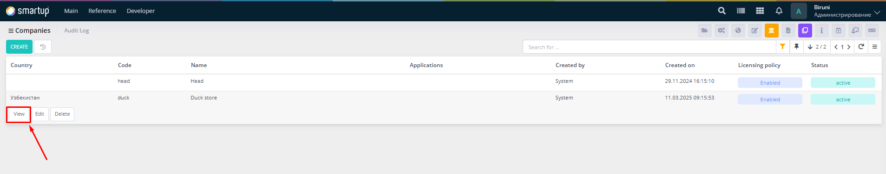<figcaption></figcaption></figure>

4. **Generate the Server Code**:
   * In the company details view, under the **Information** tab, locate the **Server Code** field.
   * Click the 🔑 button (or equivalent icon) to generate the **Server Code**.

<figure>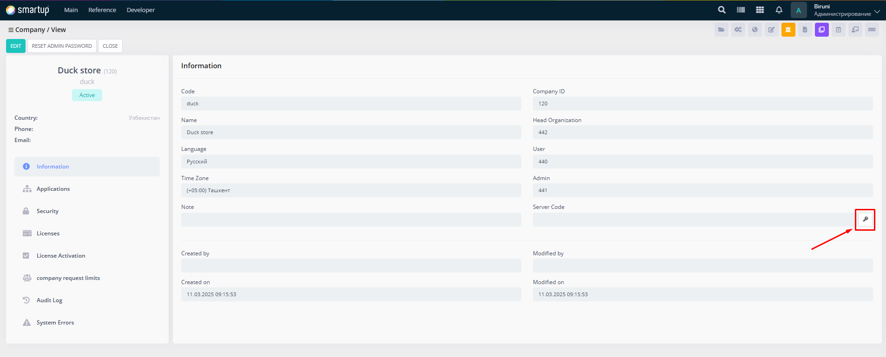<figcaption></figcaption></figure>

5. **Copy the Generated Server Code**:
   * Once generated, copy the **Server Code** (e.g., 0CC3-2D9F-EDC4-7C76-C680-82FA-4EF-C8AB).
   * Use this code in the **Billing** project to obtain the **Instance Activation Code.**

<figure>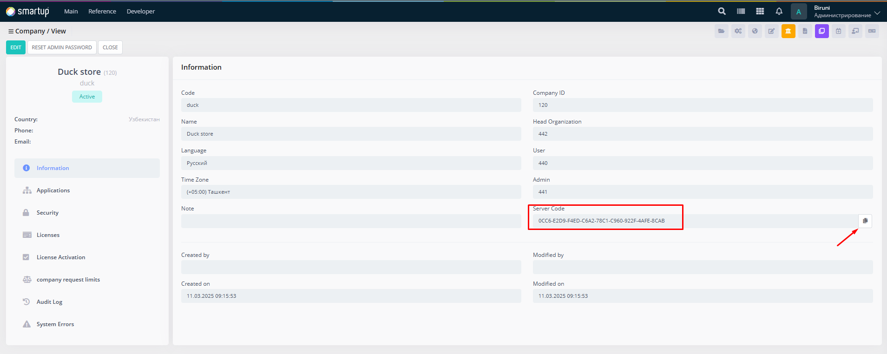<figcaption></figcaption></figure>

6. **Enter the Instance Activation Code**:
   * In the company view, navigate to the **Licenses** section and select **License Activation**.
   * Paste the **Instance Activation Code** into the **Activation Code** input field.
   * Click the **Activate** button to proceed.

<figure>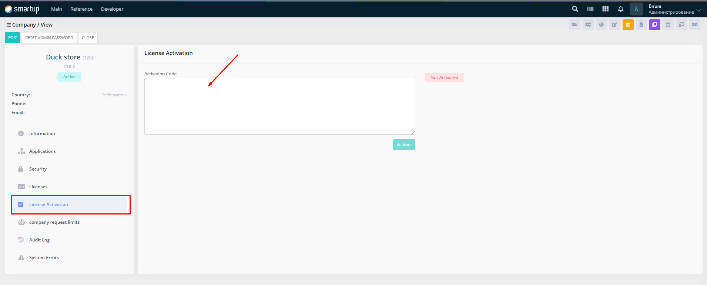<figcaption></figcaption></figure>

<figure>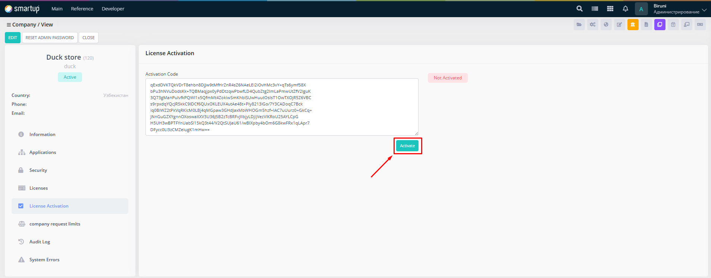<figcaption></figcaption></figure>

<figure>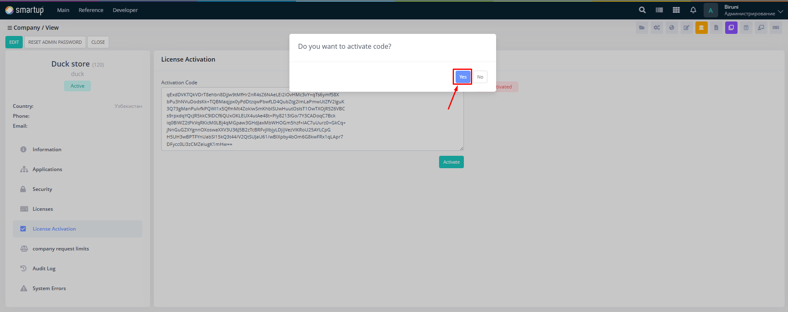<figcaption></figcaption></figure>

7. **Verify Activation**:
   * After successful activation, the status will update to **Activated**.
   * You’ll see details such as the activator’s name (e.g., "Admin") and the activation timestamp (e.g., "11.03.25 09:32:15400").
   * A **Reactivate** button may appear for future adjustments.

<figure>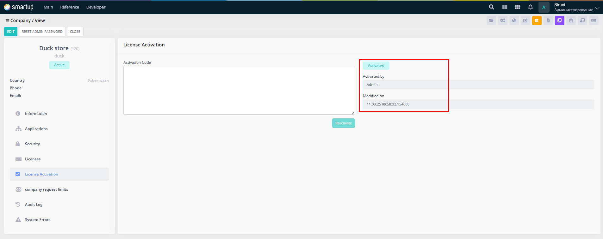<figcaption></figcaption></figure>

## Activate a License

To activate or purchase a license for a specific company, use the `/biruni/kl/license_list` form. Log in as the company admin (e.g., **admin@duck**) and follow these steps:

1. **Log in as Company Admin**:
   * Use the admin credentials for the specific company (e.g., **admin@duck**).
2. **Navigate to the License Section**:
   * From the main menu, go to **Main** > **Licenses**.
   * In the sidebar, select **Purchase** and then switch to the **Activation** tab.

<figure>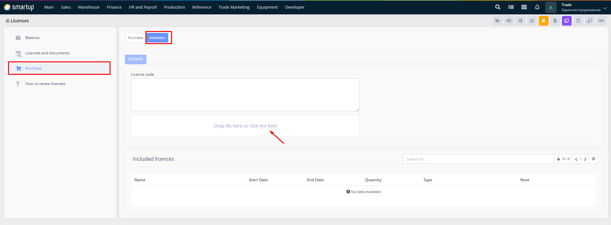<figcaption></figcaption></figure>

3. **Enter License Code or Upload File**:
   * In the **License Code** field, paste your license code manually, or upload a license file by clicking the field or dragging the file into it.

<figure>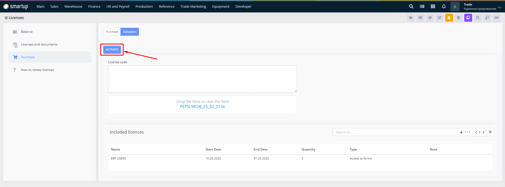<figcaption></figcaption></figure>

4. **Activate the License**:
   * Click the **Activate** button.
5. **View Active Licenses**:
   * After successful activation, view your active licenses in the **Licenses and Documents** section.
   * The table will display details such as license name, start/end dates, quantity, and type.

<figure>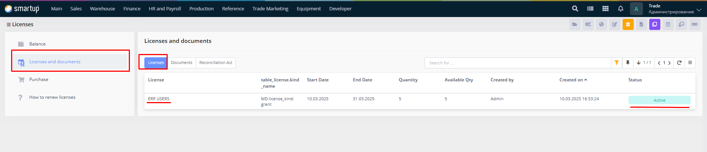<figcaption></figcaption></figure>

## License Kinds

Licenses in the system are categorized into two kinds: **Grant** and **Module**.

* **Grant Licenses**:
  * These can be assigned to specific users within the company.

<figure>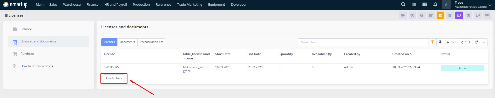<figcaption></figcaption></figure>

* **Module Licenses**
  * These are available to all users within the company and cannot be assigned to individual users.
