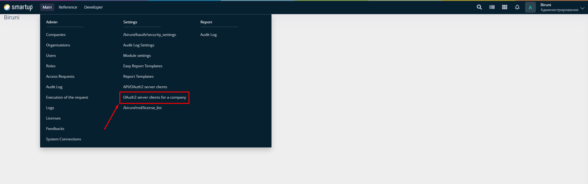
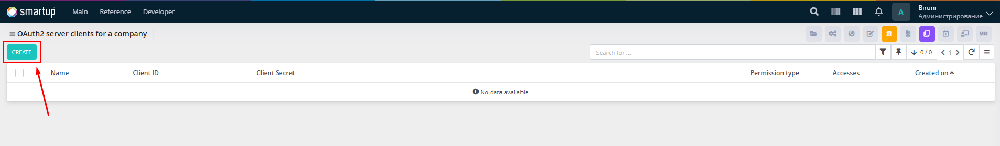
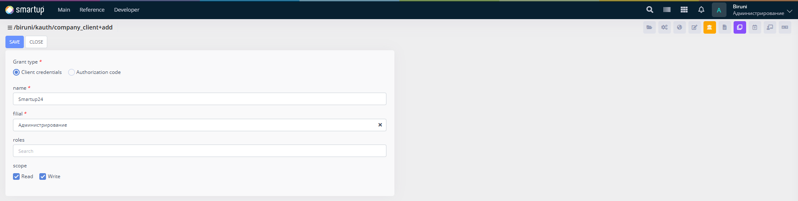
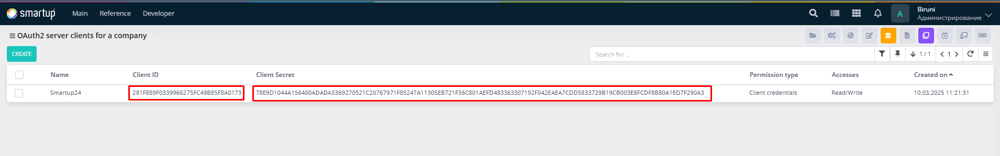

# OAuth2

This section outlines the OAuth2 authorization process in the Biruni framework, enabling secure API access for various use cases with flexible grant types. Unlike **API/OAuth2**, which focuses on token-based authentication with the **password** grant type for specific API client configurations, OAuth2 provides broader management of **OAuth2** server clients at the **company level**, overseeing authorization across the organization with support for multiple grant types such as **client\_credentials** and **authorization\_code**.

<figure><figcaption><p>OAuth2 server client for a company form In Menu</p></figcaption></figure>

## Client Setup

### Creating a Client

* To use OAuth2 authorization, a client\_id and client\_secret must be created.

<figure><figcaption><p>View all clients (<code>/biruni/kauth/company_client_list</code>)</p></figcaption></figure>

<figure><figcaption><p>Create a client (<code>/biruni/kauth/company_client+add</code>)</p></figcaption></figure>

### Grant Types

* OAuth2 supports two primary grant types:
  * **client\_credentials**: For server-to-server communication (e.g., backend API access).
  * **authorization\_code**: For client-to-server communication (e.g., frontend API access).

### Client Credentials Setup

* When using the client\_credentials grant type, select a filial and roles for the client during creation to define access permissions.

### Scopes

* Scopes limit API access (e.g., read, write, or read+write).
* This feature is not yet implemented but will be configurable when creating or editing routes.


You can create multiple clients, each with unique **client\_id** and **client\_secret**.

<figure><figcaption><p><strong>client_id</strong> and <strong>client_secret</strong></p></figcaption></figure>

## Endpoints

### Token Generation and Refresh

* **URL**: `[server_url]/security/oauth/token`

### **Generating Access Token with client\_credentials**


```json
{
  "grant_type": "client_credentials",
  "client_id": "some_generated_client_id",
  "client_secret": "some_generated_client_secret",
  "scope": "read+write"
}
```


* **Requirement**: grant\_type must be client\_credentials.
* **Scope Example**: read+write, read, or write.

### **Generating Access Token with authorization\_code**


```json
{
  "grant_type": "authorization_code",
  "client_id": "some_generated_client_id",
  "client_secret": "some_generated_client_secret",
  "code": "some_code",
  "redirect_uri": "some_redirect_uri"
}
```


* **Requirement**: grant\_type must be authorization\_code.
* **Code**: Generated by the server and sent to the client.
* **Redirect URI**: Must match the client’s registered URI.

### **Refreshing a Token**


```json
{
  "grant_type": "refresh_token",
  "client_id": "some_generated_client_id",
  "client_secret": "some_generated_client_secret",
  "refresh_token": "some_refresh_token"
}
```


* **Requirement**: grant\_type must be refresh\_token.
* **Refresh Token**: Provided by the server in the initial token response.

### Token Response

```json
{
  "access_token": "some_token",
  "refresh_token": "some_token",
  "expires_in": 10800,
  "token_type": "bearer"
}
```

* **access\_token**: 64 characters long, used for API authentication.
* **refresh\_token**: 64 characters long, used to obtain a new access\_token.
* **expires\_in**: Seconds until the access\_token expires (e.g., 10800 = 3 hours).
* **token\_type**: Always bearer.

### Generating Authorization Code

* **URL**: `[server_url]/security/oauth/code`
* **Method**: GET

```json
{
  "response_type": "code",
  "client_id": "some_generated_client_id",
  "redirect_uri": "some_redirect_uri",
  "scope": "read+write",
  "state": "some_state"
}
```

* **Requirement**: response\_type must be code.
* **Redirect URI**: The URI the server redirects to after authorization.
* **State**: Optional parameter for client use (e.g., CSRF protection).

```json
{
  "code": "some_code",
  "state": "some_state"
}
```

* **Code**: Used to generate an access\_token.
* **State**: Matches the request parameter.

### Error Handling

* **Content-Type**: application/json
* **Status Codes**: 400, 401, or 500

```json
{
  "error": "invalid_request",
  "error_description": "Invalid request"
}
```

* **error**: The error code.
* **error\_description**: Details about the error.
* Refer to `/biruni/kauth/kauth_errors.pck` for a full list of error codes and descriptions.

### Usage

* Include the **access\_token** in the Authorization header (e.g., Authorization: Bearer \<access\_token>) for API requests.
* Use the **refresh\_token** to request a new **access\_token** when the current one expires.

