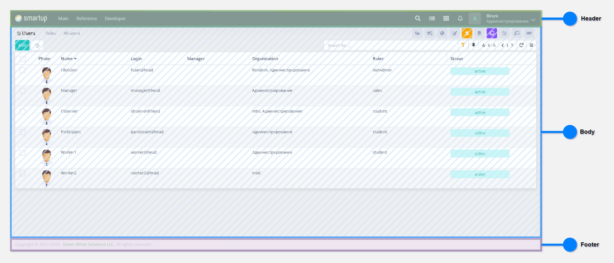
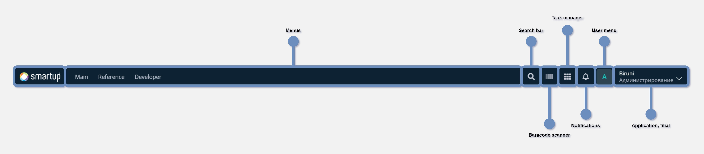
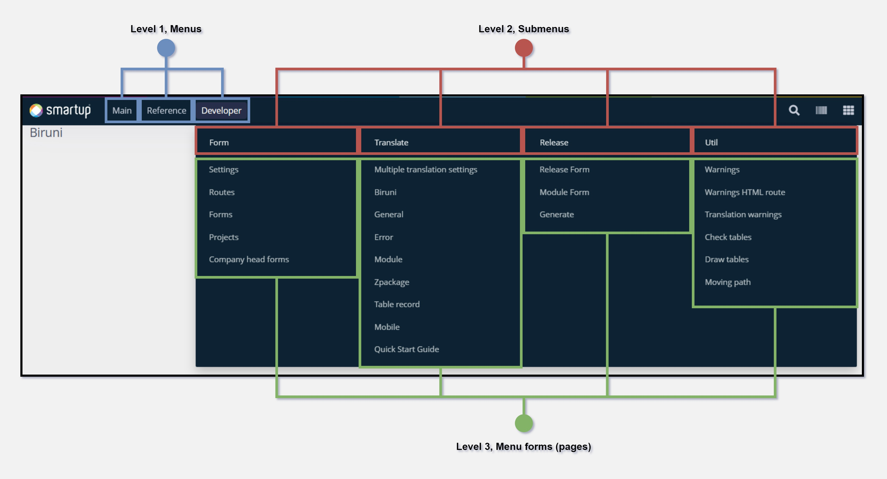
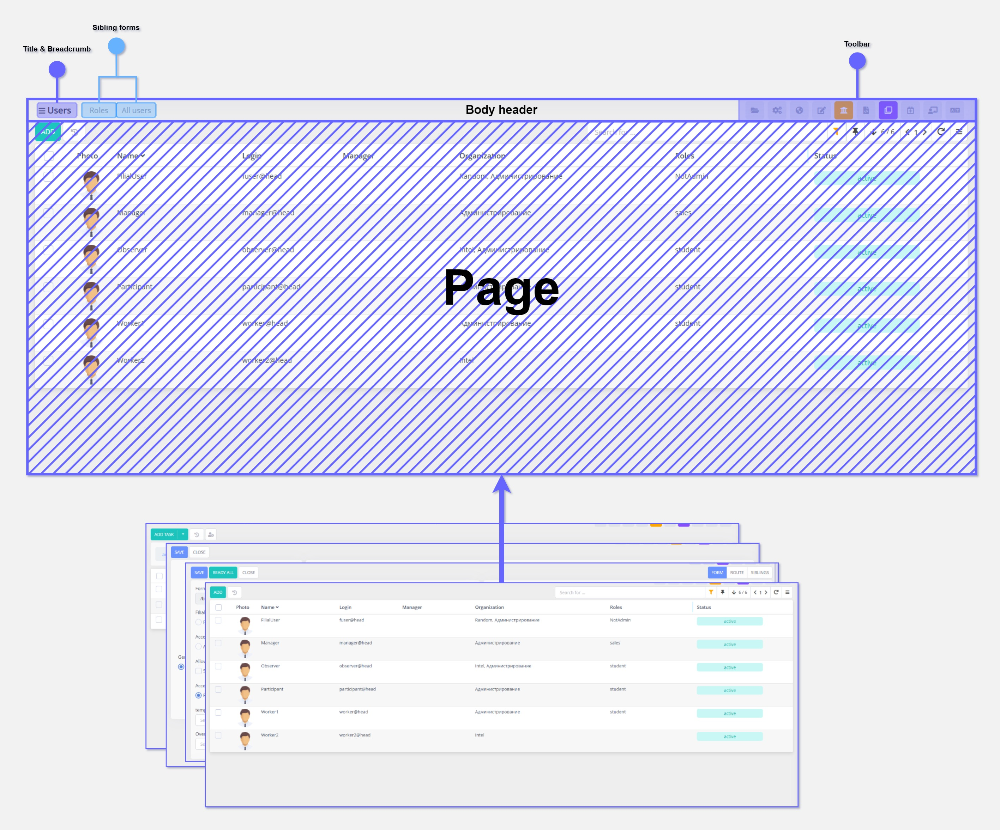

# Views

The user interface of the Biruni web application follows a structured layout consisting of three main sections: Header, Body, and Footer. The application is a single-page application (SPA), meaning that only the Body section updates dynamically while the Header and Footer remain unchanged, ensuring smooth navigation and a seamless user experience.

<figure><figcaption>
Page layout
</figcaption></figure>

## Header

The **navigation bar** provides quick access to essential features, including menus for different pages, a search bar, task manager, barcode scanner, and notifications. It also includes a **user menu** for account settings. This design ensures easy navigation and efficient user interaction.

<figure><figcaption>
Navbar content
</figcaption></figure>

### Menus

The **menu structure** follows a three-level hierarchy: **Level 1 (Menus)** provides access to main sections, **Level 2 (Submenus)** categorizes options under each menu, and **Level 3** contains forms (pages). This approach ensures organized navigation and quick access to selected page. For example, take a look at Developer menu structure:

<figure><figcaption>
Menu architecture
</figcaption></figure>

## Body

The **Body** section of the Biruni web application follows a structured layout designed to handle dynamic content while maintaining consistency in the overall user interface. The Body is where different **forms** (or pages) are displayed, depending on user interaction, while the **Header** and **Footer** remain unchanged.

<figure><figcaption>
Dynamic body structure
</figcaption></figure>

#### Body header

The Body header includes the page title, breadcrumb navigation, [sibling form](forms-view/#form-siblings) navigation, and a toolbar.

* **Breadcrumb navigation —** stores previous page navigation links by order
* **Toolbar —** contains support tools that significantly enhance productivity, especially for developers, they play a crucial role in the development process.

## Developer profile

If the project profile is dev, it contains multiple developer menus(1) in the navbar and useful developer tools.

<figure><figcaption></figcaption></figure>

Here are most useful developer tools:

2. **Open file** - opens html file of the current form in the editor (e.g. Visual Studio Code)
3. **Form info** - Navigates to the form settings of current page
4. **Translate -** Quick access to the page translates
5. **Tour** - Helps to create navigation guideline for the current form
6. **Translate multipele** — Enables multiple translates at once
7. **Fast translate** — Direct translation from the form itself
8. **Subpages** — list of subpages used in the current form
