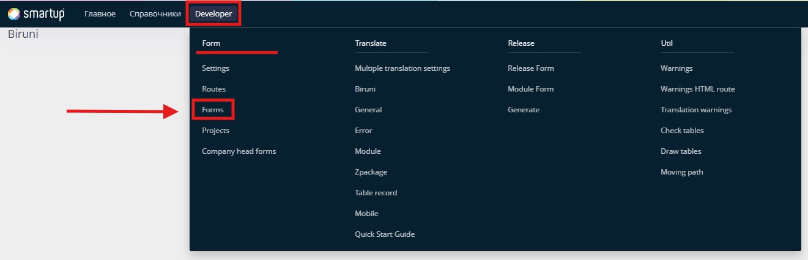
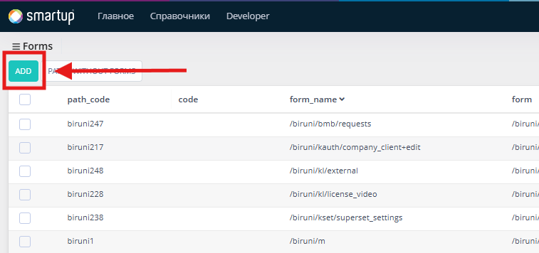
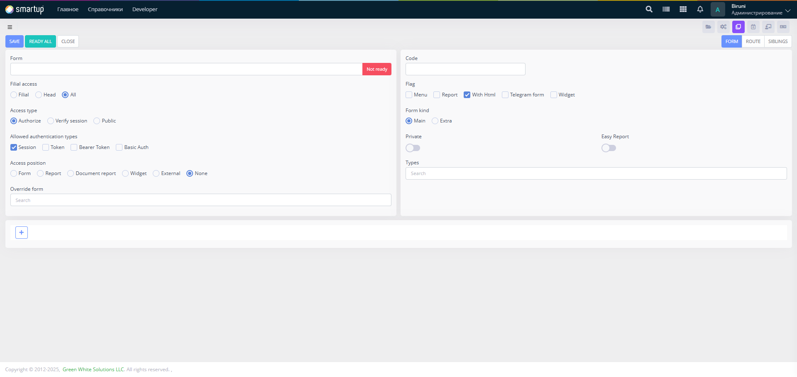
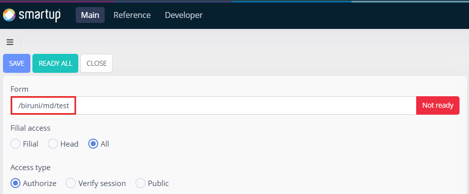
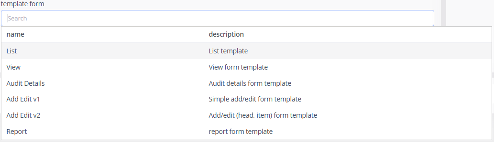
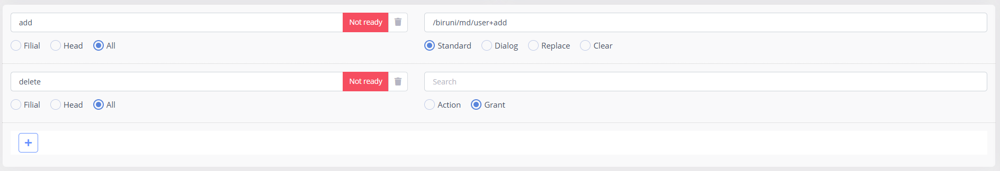

# Forms (view)

In Biruni-based projects, every page is considered a form (except authentication pages). Forms differ based on their functionality and purpose.

## Creating new form

### Forms can be created as follows:

1. Navigate to **Developer > Forms > Forms**, open the menu:

<figure><figcaption><p>Developer menu</p></figcaption></figure>

2. Click **Add** button and there you will see form creating page:

<div align="center"><figure><figcaption><p>Deveoper form list page</p></figcaption></figure></div>

After successfully creating a new form, a unique path code will be generated for it. The path code always begins with the current project code (e.g., `biruni19`). It plays a crucial role in integrating with Oracle PL/SQL UI packages.

## Form page

Every form created manally can access this form page below:

<figure><figcaption><p>Form page</p></figcaption></figure>

### Form

<figure><figcaption></figcaption></figure>

In the example above, the full URL of the form is given. The section highlighted in yellow represents the **Path prefix**, followed by the F**orm path**, which is highlighted in red.

<figure><figcaption></figcaption></figure>

```
/project_code/module_name/form_name
```

When filling out the input field, entering the project code is required. After the project code, the module name should be specified. After module name you can specify package name or form name. However the path should end with form name.

Examples for form path:

```
/biruni/md/test
/biruni/md/rep/test_report
```

* `biruni` — project code
* `md` — module name
* `rep` — folder name
* `test_report`, `test` — name of the form

Folder structure of the given example:

```
📁biruni                                      # application name
└── 📁main                                    # main folder
    └── 📁page                                # pages folder
        └── 📁form                            # forms folder for html files
            └── 📁biruni                      # project code
                └── 📁md                      # module name
                    ├── 📁rep                 # folder
                    │   └── test_report.html  # form html file
                    └── test.html             # form html file
```

### Filial access

The form can be attached to head filial (Administration) or custom filial (created by admin) or both.

* **All** — Both head filial and normal filial users can access this form.
* **Head** — Only users in the head filial can access this form.
* **Filial** — Only users in normal filials can access this form.


When a new company is created, a head filial (Administration) is also established. Any additional filials created afterward are regular filials. Only one head filial can exist in a company.


### Access type

Three access types can be selected for the form:

1. **Authorize** — Only users with granted privileges can access the form.
2. **Verify Session** — Forms with this access type are available to all authenticated users.
3. **Public** — Public routes are accessible to everyone.

### Allowed authentication types

* **Session** — Uses server-side sessions to store authentication data. A session ID is stored in cookies and sent with each request.
* **Token** — Uses a custom token for authentication, usually sent in request headers.
* **Bearer Token** — A type of token-based authentication where the token is included in the `Authorization` header.
* **Basic Auth** — Uses a username and password encoded in Base64 and sent in the `Authorization` header.

### Access position

Forms divide into multiple access positions according to their purpose. In Biruni there are 5 categories of forms:

1. Form — Regular form
2. Report — In Biruni there is robust reporting mechanism. Specifically  Biruni report and Biruni easy report, Lazy report
3. Document report — invoices
4. Widget — widget forms used inside other forms as a component or subpage
5. External — for external API


By default, the access position is set to "None", which does not allow the creation of a new form. You must select one of the five available access positions.


### Template form

When access position is set to "Form" you can use template forms. There are mutiple pre-build template forms to simplify the development further.

<figure><figcaption><p>Template forms</p></figcaption></figure>

You can select a template based on the form type and it generates `.html` file in the specified [path](./#form). Each template includes clear instructions on creating basic list, view, audit, add/edit, and report forms.

### Flags

The functionalities of the form can be flagged by these options:

* **Menu** — Checked if the form is used in the navbar menu.
* **Report** — Checked if the form is a report type.
* **With HTML** — Checked if the form has an attached HTML file.
* **Telegram Form** — Checked if the form is integrated with Telegram.
* **Widget** — Checked if the form functions as a widget.

## **Form actions**

From the footer of the [form page](./#form-page) you can add form actions with **Plus** button

<figure><figcaption></figcaption></figure>

There are two types of form actions and both of them enables role-based control:

1. **Action** — Select this to navigate to a related form. The target form must be specified. Additionally, there are four different operations for navigation:
   1. **Empty** — Only manages role-based control over form actions.
   2. **Standard** — Navigates to the target form while keeping the previous form in the breadcrumb, allowing you to go back.
   3. **Dialog** — Similar to Standard but also carries additional data to the target form.
   4. **Replace** — Replaces the current form with the target form, removing the current form from the breadcrumb.
   5. **Clear** — Clears the breadcrumb and opens the target form.
2. **Grant** **—** Only grants role access

## **Form siblings**

Form siblings allow you to attach other forms to the current form, enabling quick navigation when working with multiple related forms.

<figure><figcaption></figcaption></figure>


[form-html-file.md](form-html-file.md)

