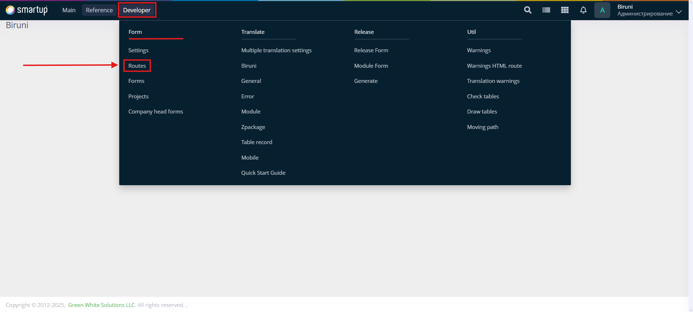
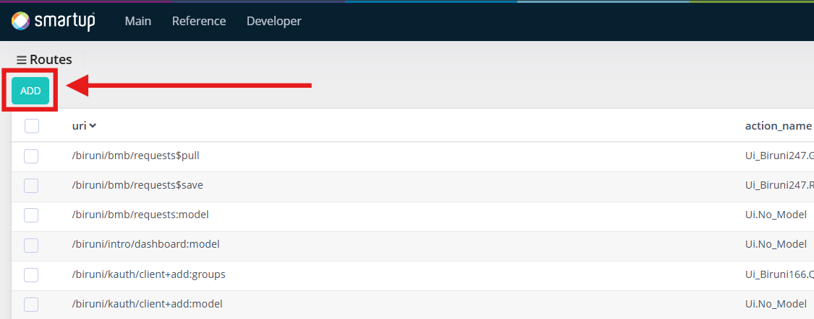
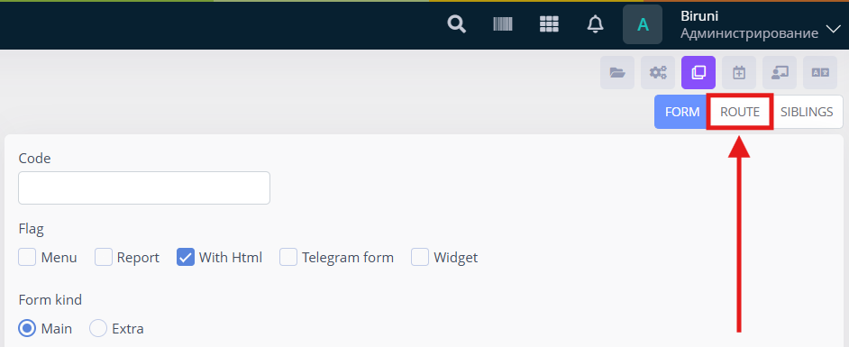

# Routing

Routing system in Biruni is controlled from UI, providing seamless interaction and quick development

## Creating new route

There are two ways of creating new routes:

1. From Developers menu
2. From form info

### From developers menu

1. Navigate to **Developer > Forms > Routes**, open the menu:

<figure><figcaption>
Developer menu
</figcaption></figure>

2. Click the **Add** button to open the route creation page:

<figure><figcaption>
Developer route list page
</figcaption></figure>


It is recommended to create & modify routes [from form info](routing.md#from-form-info) as it provides a more flexible approach


### From form info

1. Open the form you wanted to add routes
2. Go to form info from developer toolbar
3. Navigate to Route tab:

<figure><figcaption>
Form info page
</figcaption></figure>

Here by linking a URI action path to an action within the Oracle packages, a new route is created. Additionally, the route can be modified in the route settings, as shown in the image.

<figure><figcaption>
Form info route tab
</figcaption></figure>

#### URI Action Path

An action path always starts with either `:` or `$`:

* If the action path starts with `:`, its behavior is limited:
  * It can be executed in HTML form using `page.post(':action_name', data)`, e.g., `page.post(':save', {test_id: 2, items: [1, 2, 3]})`.
  * Its access type is implicitly inherited from the parent form.
* In some cases, `$` is preferable, those actions are created via [form actions](forms-view/#form-actions) section of parent form info.
  * They can be executed HTML form using `page.post('$action_name', data)`, e.g., `page.post('$save', {test_id: 2, items: [1, 2, 3]})`.
  * `$` enables role-based access control using `fi` in the HTML form. `fi` functions similarly to `page.post()`, with the key difference being role access control.


In Biruni, `$` has a unique feature beyond the form actions discussed. While the access type cannot be changed when the action path starts with `:`, it can be changed when it starts with `$`.


#### Action

When triggered, the action executes a function or procedure in Oracle packages based on the provided path. The action consists of the package name and the procedure/function name inside the package, separated by a full stop (e.g., `Ui_Biruni7.Add`).

## Route page

This page is responsible for route settings of any route:

<figure><figcaption></figcaption></figure>

### Uri

Once route is created the URI is readonly, representing the URI of the action path starting with form path and concatinated with the action path. &#x20;

### Access type

Four access types can be selected for the route:

1. **Authorize** — Only users with granted privileges can access the form.
2. **Edit Session** — These are public routes, but they can create and remove sessions. Login and logout pages utilize these routes.
3. **Verify Session** — Forms with this access type are available to all authenticated users.
4. **Public** — Public routes are accessible to everyone.

By default route inherits access type from parent [form info](forms-view/#access-type).

### Allowed authentication types

* **Session** — Uses server-side sessions to store authentication data. A session ID is stored in cookies and sent with each request.
* **Token** — Uses a custom token for authentication, usually sent in request headers.
* **Bearer Token** — A type of token-based authentication where the token is included in the `Authorization` header.
* **Basic Auth** — Uses a username and password encoded in Base64 and sent in the `Authorization` header.

### Review

When the review checkbox is checked, it activates a feature that wraps incoming data into a review format. This format includes:

* Route parent form information
* Return data from the action
* Sibling forms titles and urls

### Scope

In OAuth2 authentication, **scopes** define the level of access granted to a client. Clients can be given `read` or `write` permissions, allowing controlled access to the API and restricting what actions they can perform.

### Route kind

There are two types of routes:

1. **Normal** — Standard request handling.
2. **Balancer** — Uses a route balancer to control requests.

#### Balancer Route

The route balancer ensures efficient request handling:

* If a client from the same session repeatedly makes the same request, only the first request is executed.
* All subsequent identical requests wait for the first one to complete.
* Once the first request finishes, all waiting requests receive the same result.

Balancer settings:

* **Balancer timeout**: Defines how long a request waits (60-1800 seconds).
* **Maximum execution time**: Limits request execution time (60-7200 seconds).

<figure><figcaption>
Route balancer
</figcaption></figure>

### Log policy

In Biruni, route logs are stored in the `biruni_log` and `biruni_log_inputs` tables based on the configured log policy.

* **Success** — Stores successful route responses.
* **Error** — Logs when the database fails to execute the route procedure/function.
* **Fatal** — Logs critical failures.
* **Unauthenticated** — Stores route requests from unauthenticated users.
* **Refused** — Logs route requests from users without sufficient privileges.
* **Log Time Limit (Milliseconds)** — If a request exceeds the specified execution time, its details will be stored.

To store requests along with their input data, enable the **"With Input"** option accordingly.

