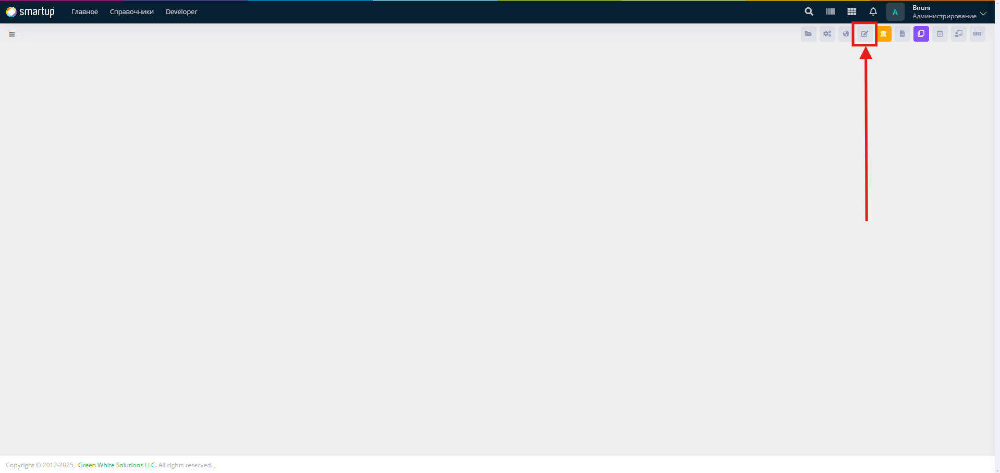
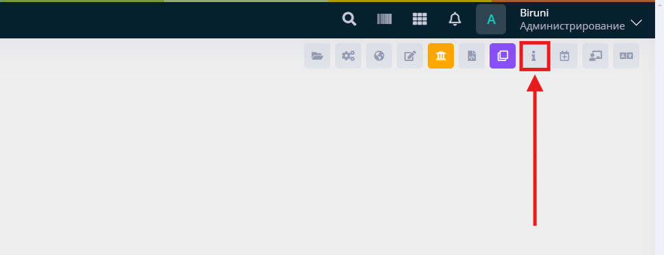

# Tour

Tour is a developer tool that helps to create navigation guide for the form. It is accessible in the **Developer toolbar**:

<figure><figcaption></figcaption></figure>

## Create the tour

The tour may include one or more steps, depending on the level of explanation required for the form. Each step consists of an element, title, description, and the position of the popup modal.

<figure><figcaption></figcaption></figure>

Once you create a tour new button appreas in the **Developer toolbar**:

Click the "**Show Tour**" button to navigate through each step of the tour.

<figure><figcaption></figcaption></figure>

## Element selection

You can use CSS selector for this field. Html DOM elements can be selected by classname, id or tagname. If there are many elements selected then first one will be chosen.

Sample examples for the selector:

* Select by id: `#myElement`
* Select by class: `.myClass`&#x20;
* Select by tagname: `button`&#x20;


Selecting elements by their **id** is recommended as they provide uniqueness and give more clear path


## Usage

Selection by id example:


```html
<button id="addUser" type="button" class="btn btn-success">Add</button>
```


This video provides a quick overview of the tour mechanism:


