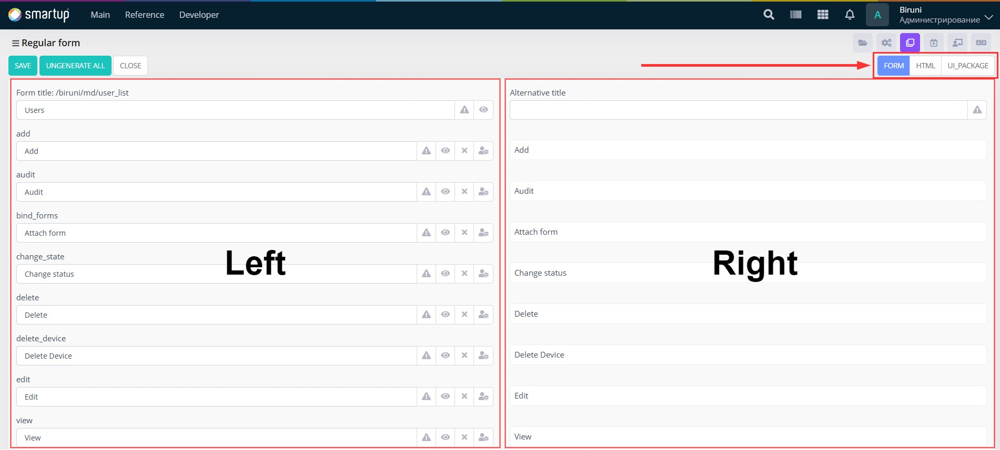
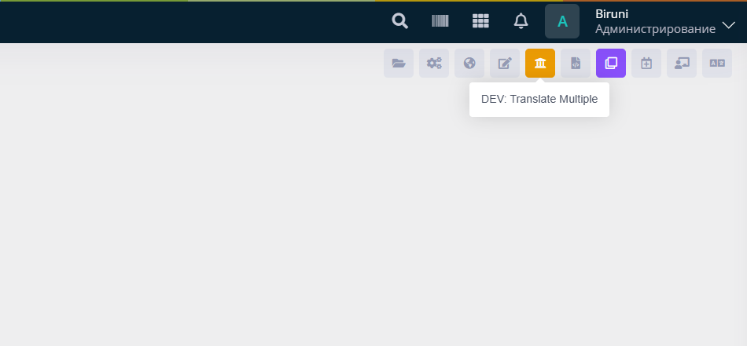
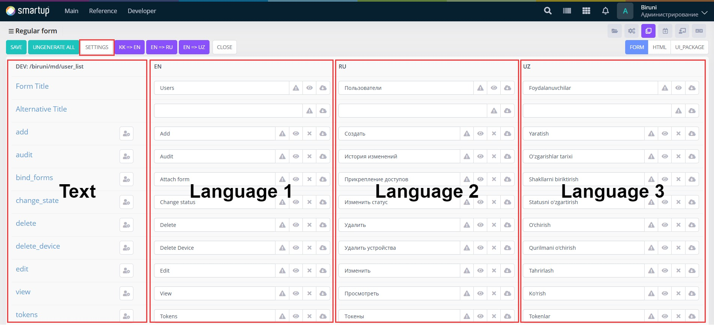

# Translate

Biruni is designed to support all languages. Additionally, for developers, the work process is made very fast and easy when working with languages.

## Page translation

You can access page translation from the toolbar:

<figure><figcaption><p>Translate page</p></figcaption></figure>

Translate page left side has inputs and their labels where labels are the words being translated and the inputs themselves are the translation. Right side is readonly translation result.&#x20;

<figure><figcaption></figcaption></figure>

Translate page consists of three sections tabs:

* Form
* HTML
* UI\_Package

### Form

In this section form title and [form actions](forms-view/#form-actions) are being translated. With the help of `fi` (Form info) we can use translates of the form actions instread of static button name. Example:


```html
<button type="button" ng-click="fi.add()">{{ fi.add.title }}</button>
```


### HTML

In the HTML form of the page we have both HTML and JavaScript version of the translation tools

1. \<t>\</t> tag for HTML
2. t function for JavaScript

#### HTML tag usage

```
<t>text</t>
```

This is the simplest way to use it, you can also use dynamic values with the help of `$` sign:

```
<t p1="..." p2="..." p3="...">text $1, $2, $3<t>
```

Here `...` can be replaced by angularJS code or JS code or even static values. The tag can have 10 dynamic values at most.

Example for \<t> usage:

```html
<t p1="q.checked.size">delete $1</t>
```

#### JavaScript t funciton

Simple usage of t function:

```
t("text")()
```

With dynamic values being included it will be like this:

```
t("text $1, $2 and $3, ...")(value1, value2, value3, ...)
```

### UI\_Package

For Ui packages there is a helper function for translates:

```
Function t
  (
    i_Message varchar2,
    i_P1      varchar2 := null,
    i_P2      varchar2 := null,
    i_P3      varchar2 := null,
    i_P4      varchar2 := null,
    i_P5      varchar2 := null
  ) return varchar2 is
  begin
    return b.Translate('UI-PATH_ID:' || i_Message, i_P1, i_P2, i_P3, i_P4, i_P5);
  end;
```

Example for UI-PATH\_ID: `UI-biruni100`, `UI-trade110`&#x20;

#### Usage:

You can replace any varchar2 text with `t('text')` making it translatable through translate page, "UI\_PACKAGE" tab.

## Tranlate multiple

Basic translation we have seen above only translates to the current web application language selected. But If you want to translate the texts to the multiple languages at once use "Translate multiple" form the toolbar:

<figure><figcaption><p>Translate multiple</p></figcaption></figure>

In the "Translate multiple" page text (words) on the left side are being translated to the languages on the right side:&#x20;

<figure><figcaption><p>Translate multiple page</p></figcaption></figure>

### Add/remove languages

In order to add languages to the form (remove languages from the form) navigate to "Settings" and select the languages needed for translation:

<figure><figcaption><p>Translate mutiple settings</p></figcaption></figure>

* **view** — enable this to add language to "Translate multiiple" form (gives readonly access)
* **edit** — makes the langage editable
